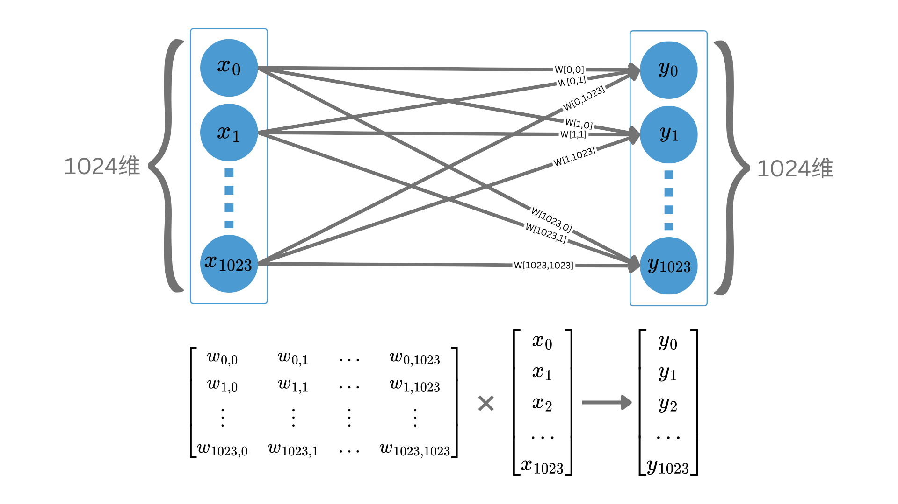

# 2.7 注意力机制

图2.3的连线其实有更为直观的解释。由于每组向量对应于一个字，我们可以认为它构建了字与字之间的连接关系。细心的同学可能发现，虽然中间层每组向量的元素个数可以与输入不同，但向量的组数却仍然是255个。图中可以看到，每个输入向量都发出了一条水平箭头指向右侧的中间层向量。这其实是经过精心设计的。

理论上，中间层的组数也可以任意设置，就像图2.2中的连接一样，不用考虑中间层具体有多少个神经元。但让它和输入层数量一致有明显的好处。一方面，从语义上我们更容易区分每个中间层向量到底与哪个字对应；另一方面，我们可以增加层数，在中间层和输出层之间再插入若干个中间层，而且每一层的每个向量都可以对应于特定的字。

当向量与字对应之后，我们就对整个神经网络在做的事情有了一个宏观的了解。比如，我们可以认为，图2.3中间层的第一组神经元尝试从输入的255个字中提取信息，以加深自己对第一个字的理解。换句话说，第一个字在1024维空间中的高维表示从输入向量变成了中间层的输出向量，而且综合了其它字的信息。可能你暂时想不明白这个变化意味着什么，让我们来看个例子。

假设输入的是这么一句话：“只要你向着阳光走，影子就会躲在后面”。这句话里面，“光”预示着光明的未来，是一种积极的意象。但如果换成这句：“我炒股把家底都输光了”。这里的“光”则表示空空如也，暗示着悲惨的结局。多义字在中文并不少见，这也是为什么2.5节强调了我们要在高维空间中表示字的含义。然而，虽然输入层的“光”需要包括它所蕴含的各种含义，中间层则不一定。在看过了整句话中的其它字后，作为人类，我们很容易明白，“光”在当前这句话中应取其积极含义。于是，中间层的“光”可以只保留有关的含义而丢弃无关的含义，向量在1024维空间中从原始位置移动到另一个更接近其真实用意的位置。这便是我们希望神经网络做的事情。


我们从神经网络的结构推测其内部的工作机制，虽然不一定对，但结构与功能通常是紧密相关的。正因为我们希望它以某种方式处理数据，我们才把网络设计成特定的样子。本文有时以目标出发引导大家想出合理的方案，但有时我会直接给出合理的方案，然后解释为什么这样设计。希望读者可以跟随文中的思路，必要时停下来思考一下再往后读。


如果进一步细化这件事，我们会发现里面包含了两个关键操作。

第一是把其它字与当前字关联起来，从而缩窄当前字的含义范围。这一步往往要求我们注意某些真正重要的字，而不必在意其它无关紧要的字。比如，对于“只要你向着阳光走，影子就会躲在后面”这句话，对“光”的含义影响最大的字显然是“阳”和“影”。因为假设盖住“光”字把这句话变成一个完形填空，看到“阳”和“影”大概就能明白需要填什么。这种寻找重点字的过程，被称为“注意力机制”。这是大模型基础架构中最有含金量的部分，可以说是AI大脑的核心。

第二是参考注意到的其它字，把当前字的1024维向量移动到合适的位置，即改变其内涵。

其实第二步操作比较好实现，向量在高维空间的移动本质上就是一个线性变换。如果想要把一个1024维向量变成另一个1024维向量，只需要乘上一个1024×1024的矩阵。事实上，我们前面所介绍的神经网络就是在做这件事，下图展示了神经网络等价的矩阵运算。

<figure><figcaption>
图2.4 神经网络将输入向量变换到输出向量，等价于左乘一个矩阵
</figcaption></figure>

你可以将矩阵中的元素对应到神经网络中的箭头。每条箭头包含了一个权重，用于对输入加权求和。矩阵乘法本质上也在做同样的事。在神经网络中，神经元的权重（或者说权重矩阵）就是模型的参数，训练模型其实就是调整这些权重。


需要注意的是，前文曾经提到过，人工神经元本质上是一个非线性函数，但没有提及具体实现。事实上，非线性函数往往是两个函数的叠加，先经由上图的线性变换，再施加一个非线性激活函数，比如ReLU。非线性激活函数的作用是给神经元添加一点点非线性，因为线性函数的叠加永远是线性，只有加入非线性，神经网络才能拟合更复杂的现象。本文的图解为了简单清晰，避免引入过多细节，与当前主题无关的非线性激活函数并未特地标出，请读者谅解。


解决了第二步，我们再回到第一步，思索一下如何实现字与字之间的注意力机制。

先重新概括一下我们的问题。假设我们有255个字组成的输入数据，每个字用1024维向量表示。我们希望通过某种类似于注意力的机制，让每个字的1024维向量融入其它字的信息，然后以新的255个1024维向量作为输入，进入上面讨论过的第二步，也就是图2.4中的操作。

这个问题其实仍然有些抽象，我们可以逐字分析一下具体的任务。

首先，把其它字的信息融入当前字的向量是什么意思？说白了，信息只隐含在向量里，所以我们应该是把其它字的向量融合到当前字的向量里面。但是怎么融合？最简单的方式仍然是加权求和。把其它字的向量乘上某个权重，然后叠加到当前字的向量中。

这一操作也略有迷惑性，你或许会认为，把其他字叠加到当前字难道不会混淆信息吗？就好像把255个字写在一个格子里，谁还能看得出来这是什么字。但不要忽略高维空间的性质，一个字蕴藏的含义可能压根没有1024种，在特定的上下文中，含义则进一步收缩，1024维向量其实包含了许多冗余，稀疏的信息并不能填满所有维度，因此不必担心信息放不下的问题。

然而，注意力体现在哪里呢？显然它只能体现在权重上。如果恰好让重要的字权重高，不重要的字权重低，那的确是个好方案。考虑到刚刚介绍的知识，是不是可以用一个255×255的权重矩阵来操作向量呢？毕竟，模型训练的过程会自动学习到如何给每个字分配权重。

但很遗憾，这里会重新遇到前文讨论过的输入长短不一的问题。如果我们训练的时候限制最大输入长度是255，使用的权重矩阵大小就要锁死为255×255。那么一旦我们想要用于更长的输入文本，模型就得重新训练。甚至用于更短文本的时候，模型都可能表现不佳。因为输入长度被作为模型参数的一部分，严重限制了泛化能力。

怎样才能找到一个与输入长度无关的权重，而且能调控注意力呢？

我想到一个线索。大家或许在数学课上学到过一个公式叫余弦相似度，用来衡量两个向量之间的相似程度。有没有发现，我们所追求的注意力，是否也可以当作某种意义上的相似度呢？这样的话，如果直接计算向量和向量之间的余弦相似度，然后用这个值作为权重，把其它向量叠加到当前向量中，是不是就摆脱了与长度相关的那个权重矩阵？我们用下图详细说明这个过程。

<figure><figcaption>
图2.5 用余弦相似度实现注意力机制
</figcaption></figure>

图中，第一行展示了如何求两个向量的余弦相似度，相似度的值用黄色圆圈表示。255个输入向量两两之间计算相似度后得到一个255×255的权重矩阵W，矩阵中的每个元素Wij表示第i个向量与第j个向量的相似度。第二行，用W左乘输入向量组成的输入矩阵X。学过矩阵乘法的应该知道，左侧矩阵的行数需要和右侧矩阵的列数一致，计算过程将合并这两个维度。在结果中，行数与左侧矩阵一致，列数与右侧矩阵一致。图2.5可以看出，结果恰好仍然是255行1024列，与X相同。如果细究计算的过程，可以发现，新的向量其实是根据权重矩阵对旧向量的加权求和。我们不打算在这里列出公式，但读者可以自己尝试拆分整个计算过程。


图2.5中的权重矩阵W和图2.4中的权重矩阵不是一回事。由于神经网络中的所有参数基本上都是以矩阵的形式存在，而它们的作用又可以解释为加权，所以它们几乎都被叫做权重矩阵。但读者应分清楚每个矩阵各自是在哪个环节起作用的，避免混为一谈。


到这里是否就大功告成呢？进度条告诉你事情没这么简单。

上述操作有一个反常的现象，不知你有没有发现，就是整个过程不存在可训练的参数。这就意味着我们没法通过训练让模型学会更好地寻找注意力。注意力本来是我们希望提供给输入的额外信息，然而以上的计算过程完全依赖于原始输入向量，并没有任何额外信息。如果你熟悉线性代数，稍微演算一下，就会发现新的向量其实和原向量完全线性相关，只差了一个倍数。

所以，搞了半天我们在自娱自乐，其实没什么用？但不然。注意力机制的架构的确应当这样设计，只不过还缺一点改进。

既然没有参数，我们可以想办法添加参数。在当前这个架构下，我们保留权重矩阵的形式，但改进一下权重矩阵的计算过程。不直接用输入向量的相似度，而是引入额外的参数，让参数影响相似度的结果。具体怎么做呢？其实还是老一套，再拿一个矩阵对输入做个变换呗。其实看多了读者就会发现，神经网络本质上就是矩阵乘法外面套一个非线性激活函数。只不过乘法的位置可以有各种调整的空间，从而形成了各式各样的模型结构。

对于目前的情况，我们完全可以像图2.4那样，用一个方阵把每个1024维向量变换为另一个新的1024维向量，然后再做图2.5的操作。这个方阵就是引入的额外参数，通过训练，应该可以让模型学会如何更好地寻找注意力。下图是对图2.5版本的改进。

<figure><figcaption>
图2.6 可训练的注意力机制
</figcaption></figure>

可以看到，在最前面增加了一行，使用一个1024×1024的矩阵对输入向量做变换，得到新的1024维向量，继续后面的操作。整个过程中，输入向量从X变成X'，最终成为X''。

至此，注意力机制总算到了一个勉强能用的地步。之所以说勉强能用，是因为此处的M矩阵对向量的改动有限，并不能完全利用输入的所有信息，后两行的操作仍然存在改进的空间。不过别担心，下一节我们就会看到注意力机制的终极版本，并揭开transformer的神秘面纱。


Transformer是现代大语言模型的基石，它是一个精心设计的神经网络结构，由注意力机制及其它网络层组成。从注意力机制，到transformer，再到今天的大语言模型，AI研究者们趟出了一条通往AGI（Artificial General Intelligence，通用人工智能）的道路，曙光依稀可见。

