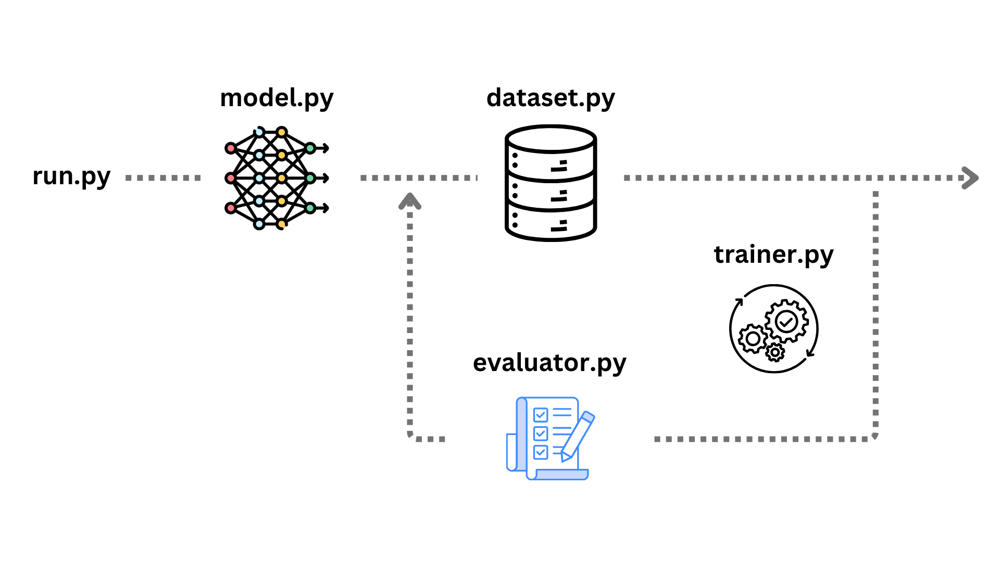

# 第10节 从理论到实现（选读）


**本节导读**

了解理论，只是懂了个大概。亲自实践，才算真正理解。那些理论上看起来简单的问题，实现的时候或许会遇到意想不到的麻烦。读完本节，你将会了解

* 代码的架构设计
* 如何使用PyTorch搭建模型
* 训练的流程
* 数据处理模块如何实现
* 评估模块如何实现

本节内容为选读，跳过本节并不会影响本书进度。


在前9节中，我们从头设计并实现了一个写诗AI。为了不让内容过于繁琐，我省略了代码实现的讲解。一方面，本书主要传达大模型的核心思想，用最短的篇幅把关键环节讲清楚。另一方面，读者未必真的需要从事大模型开发，对大部分人来说，细节可能无关紧要。

但为了照顾另一部分真正想要了解实现细节的人，本节还是对代码做个简要介绍。以下内容需要一定的编程知识，如有看不懂的地方，请直接跳过。

## 主流程设计

现在，假设你是一个程序员，你该如何设计代码架构以实现前文介绍的功能？

这个问题其实有点困难，当初尝试实现这套代码时，我也感到颇为棘手。不过，只要细细考量，办法总是有的。让我们一起尝试一下这个过程。

首先，整个流程中，最重要的部分就是模型的结构设计，以及基于此模型的训练。本书前面的大部分小节都在讨论这两件事。

模型的结构通常用PyTorch的`torch.nn.Module`类来表示，通过继承（inherit）这个类，并重写（override）`forward`方法，我们就可以自定义一个新模型，并规定其计算行为。

训练则按顺序划分为三步：预训练，指令微调，与人类偏好对齐。这三步依次进行，不断更新模型的参数。

于是，我们可以在`model.py`文件中定义一个TutorialLLM类，代表模型本身。再在`trainer.py`文件中定义一个`Trainer`类，提供`pretrain`、`finetune`、`align`等方法。借助这两个类的实例，整个训练流程就可以通过简单的函数调用来实现，我们将其写在`run.py`中，如下所示。


```python
# Import classes from model.py and trainer.py
from model import TutorialLLM
from trainer import Trainer

# Create a model instance and a trainer instance
model = TutorialLLM()
trainer = Trainer(model)

# Train the model in 3 stages
trainer.pretrain()
trainer.finetune()
trainer.align()
```


主流程就是这样，是不是很简单？不过，具体的细节都隐藏在`TutorialLLM`和`Trainer`内部，接下来我们需要好好考虑如何实现它们。

## TutorialLLM

在代码中定义模型，其实就是用PyTorch的接口实现图12的网络结构。

在图12中，某些模块，比如Embedding Table和Cross Entropy Loss，可以直接调用PyTorch自带的类库。而其核心模块——Transformer Block所代表的图11中的复杂结构，即注意力机制的实现，则需要我们自己定义。


实际上，PyTorch也提供了`torch.nn.Transformer`类。出于教学目的，我们当然要自己实现，不用这个。但真实应用的时候，显然还是直接调库比较方便。


定义模型包含两个步骤，分别对应于我们将要实现的两个方法——`__init__`和`forward`。

* `__init__`用来准备好所需的所有子模型。比如，创建一个`torch.nn.Embedding`对象，作为Embedding Table；创建一个`torch.nn.Linear`对象，作为最后的Unembedding Matrix；创建若干个`TransformerBlock`对象，等等。
* `forward`则负责把这些子模型像搭积木一样堆叠起来，前一层的输出作为后一层的输入。在我们的案例中，输入依次经过Embedding Tables、Transformer Blocks、Layer Norm、Project Layer以及Cross Entropy Loss，得到最后的输出。每一行末尾用注释标出了输入输出的维度。


```python
import torch
import torch.nn as nn

class TutorialLLM(nn.Module):

    def __init__(self, vocabulary_size: int, dim_embed: int, max_length: int, num_head: int, num_layer: int, device: str) -> None:
        super().__init__()
        self.max_length = max_length
        self.device = device
        self.token_embedding_table = nn.Embedding(vocabulary_size, dim_embed)
        self.position_embedding_table = nn.Embedding(max_length, dim_embed)
        self.transformer_blocks = nn.Sequential(*[TranformerBlock(dim_embed, num_head, max_length) for _ in range(num_layer)])
        self.layer_norm_final = nn.LayerNorm(dim_embed)
        self.project = nn.Linear(dim_embed, vocabulary_size)

    def forward(self, token_ids: Tensor, labels: Tensor = None, reduce_loss: bool = True) -> tuple[Tensor, Optional[Tensor]]:
        B, T = token_ids.shape
        token_embedding = self.token_embedding_table(token_ids) # (B, T) -> (B, T, dim_embed)
        position_embedding = self.position_embedding_table(torch.arange(T, device=self.device)) # (T) -> (T, dim_embed)
        embedding = token_embedding + position_embedding        # (B, T, dim_embed) + (T, dim_embed) -> (B, T, dim_embed)
        embedding = self.transformer_blocks(embedding)          # (B, T, dim_embed) -> (B, T, dim_embed)
        embedding = self.layer_norm_final(embedding)            # (B, T, dim_embed) -> (B, T, dim_embed)
        logits = self.project(embedding)                        # (B, T, dim_embed) -> (B, T, vocabulary_size)

        if labels is None:
            loss = None
        else:
            B, T, vocabulary_size = logits.shape
            logits = logits.view(B * T, vocabulary_size)
            labels = labels.view(B * T)
            loss = F.cross_entropy(logits, labels, reduce=reduce_loss)

        return logits, loss
```



为了简洁，本节的示例代码去掉了所有行间注释和无关的辅助函数。实际代码以GitHub仓库为准。


需要特别说明的是，我们在前文中并没有提到Position Embedding Table和Layer Norm，因为它们并非重点。Position Embedding Table与前文所介绍的Embedding Table类似，Embedding Table是把字转换为向量，而Position Embedding Table则是把该字所处的位置转变为一个向量。这是为了给输入文本增加位置信息。在之前介绍的注意力机制中，虽然我们知道哪些字位于当前字前面，但每个字的具体位置是未知的。增加位置信息可以让模型更好地体会语言的空间感，就像人们说话一样，字的前后顺序对理解语言帮助很大。

Layer Norm则是对每一层的输入数据做归一化，把输入的分布转换到某个特定的均值和方差上。这有利于降低模型的学习难度，因为转换后数据变得更有规律，训练起来效率更高。

当然，这里面最关键的是`TransformerBlock`类，需要我们自己实现。


值得一提的是，PyTorch定义的模型一层套一层。为了方便理解，我们按照从外到内的顺序一层层剥开它们的实现。


在[第6节](di-6-jie-zun-zhong-luo-ji-ju-jue-zuo-bi.md)中，我们明确了Transformer包含一个注意力机制和一个前馈神经网络，于是，`TransformerBlock`的框架可以非常简单。


```python
class TranformerBlock(nn.Module):

    def __init__(self, dim_embed: int, num_heads: int, max_length: int) -> None:
        super().__init__()
        head_size = dim_embed // num_heads
        self.multi_head_attention = MultiHeadAttention(dim_embed, num_heads, head_size, max_length)
        self.feed_forward = FeedForward(dim_embed)
        self.layer_norm1 = nn.LayerNorm(dim_embed)
        self.layer_norm2 = nn.LayerNorm(dim_embed)

    def forward(self, input: Tensor) -> Tensor:
        output = input + self.multi_head_attention(self.layer_norm1(input)) # (B, T, dim_embed) + (B, T, dim_embed) -> (B, T, dim_embed)
        output = output + self.feed_forward(self.layer_norm2(output))       # (B, T, dim_embed) + (B, T, dim_embed) -> (B, T, dim_embed)
        return output
```


可以看到，这里调用`MultiHeadAttention`类实现注意力机制，调用`FeedForward`类实现前馈神经网络。当然，这两个类也需要我们自己定义。

`MultiHeadAttention`是注意力机制的实用版本。前文所讲解的注意力机制叫做单头注意力（Single Head Attention），Query、Key、Value矩阵各有一份。而实际上，我们完全可以将其扩展到多份，每一套Query、Key、Value矩阵称作一个头（Head），每个头独立处理相同的输入，输出不同结果。最后用一个线性变换把所有结合合并起来。具体实现如下。


```python
class MultiHeadAttention(nn.Module):

    def __init__(self, dim_embed: int, num_heads: int, head_size: int, max_length: int) -> None:
        super().__init__()
        self.heads = nn.ModuleList([AttentionHead(dim_embed, head_size, max_length) for _ in range(num_heads)])
        self.project = nn.Linear(head_size * num_heads, dim_embed)

    def forward(self, input: Tensor) -> Tensor:
        output = torch.cat([head(input) for head in self.heads], dim=-1)    # (B, T, dim_embed) -> [(B, T, head_size)] * num_heads -> (B, T, head_size * num_heads)
        output = self.project(output)                                       # (B, T, head_size * num_heads) -> (B, T, dim_embed)
        return output
```


其中，`AttentionHead`类代表了单头注意力机制，下面会详细解读。`nn.Linear`则是一个线性变换，用来处理所有头的输出结果，以保证最终的输出维度与输入一致。

现在，来到最最核心的`AttentionHead`类，看看注意力机制究竟是如何实现的。


```python
class AttentionHead(nn.Module):

    def __init__(self, dim_embed: int, head_size: int, max_length: int) -> None:
        super().__init__()
        self.project_to_key = nn.Linear(dim_embed, head_size, bias=False)
        self.project_to_query = nn.Linear(dim_embed, head_size, bias=False)
        self.project_to_value = nn.Linear(dim_embed, head_size, bias=False)
        self.register_buffer('tril', torch.tril(torch.ones(max_length, max_length)))

    def forward(self, input: Tensor) -> Tensor:
        B, T, dim_embed = input.shape
        key = self.project_to_key(input)          # (B, T, dim_embed) -> (B, T, head_size)
        query = self.project_to_query(input)      # (B, T, dim_embed) -> (B, T, head_size)
        value = self.project_to_value(input)      # (B, T, dim_embed) -> (B, T, head_size)
        weights = query @ key.transpose(-2, -1)   # (B, T, head_size) @ (B, head_size, T) -> (B, T, T)
        weights *= dim_embed ** -0.5
        weights = weights.masked_fill(self.tril[:T, :T] == 0, float('-inf'))
        weights = F.softmax(weights, dim=-1)
        output = weights @ value                  # (B, T, T) @ (B, T, head_size) -> (B, T, head_size)
        return output
```


初始化阶段，创建了三个线性变换，分别对应于Query、Key、Value矩阵，想必读者很容易理解。但随后的`self.register_buffer`则有些奇怪。这个函数是`nn.Module`类提供的方法，用于缓存一些和模型有关，但不属于模型参数的值。这里缓存的是一个通过`torch.tril`获得的下三角矩阵，并将其名称记作“tril”。这个名称可以直接在`forward`函数中当作成员变量来使用。

在`forward`函数中，先分别将Query、Key和Value矩阵作用于输入向量，得到`query`、`key`和`value`三个向量。需要注意的是，虽然我们称`query`、`key`和`value`为向量，但实际上它们并不只有一个维度。从注释中可以看到，每个`query`、`key`或`value`向量的维度是(B, T, head\_size)。其中，head\_size是向量本身的维度；T则是指文本长度这个维度，也就是说，输入共有T个字，每个字对应的向量维度是head\_size；而B则是指`batch_size`，即每一批同时处理的数据个数。

这三个维度中，我们完全不必考虑B维度，因为模型不会跨样本操作，处理一批数据和处理单个样本并没有什么区别。但后面两个维度常常让人困惑。不过，读到此处的读者或许略有印象，注意力机制的精髓其实就在于跨T维度的操作，通过在多个字之间寻找相关性，从而让上下文信息在字向量中融会贯通。此处的head\_size维度便是所谓的字向量。

于是，当我们计算`query @ key.transpose(-2, -1)`时，相当于将`query`中的每个字向量与`key`中的每个字向量求相似度，从而得到T×T大小的方阵，记作`weights`。方阵中的每个元素代表了某个字对另一个字来说的重要性。

紧接着是一个前文没有提到的操作，`weights *= dim_embed ** -0.5`。它让`weights`中的所有元素统一缩小根号`dim_embed`倍，本质上也是一种归一化，作用仍然是稳定模型的训练。

然后，最关键的两步来了。`weights = weights.masked_fill(self.tril[:T, :T] == 0, float('-inf'))`利用最开始缓存的下三角矩阵将`weights`的上三角区域重置为0，意味着每个字向量只能参考前面字的信息，不能参考后面字的信息。`weights = F.softmax(weights, dim=-1)`进一步将相似度转换为概率。

最后，output = weights @ value按照概率混合各个字之间的信息。新的字向量由此输出。

现在，只差Transformer Block的第二部分——`FeedForward`类还没介绍。不过好在这个模型非常简单，几行代码就能搞定。


```python
class FeedForward(nn.Module):

    def __init__(self, dim_embed: int) -> None:
        super().__init__()
        self.feed_forward = nn.Sequential(
            nn.Linear(dim_embed, 4 * dim_embed),
            nn.ReLU(),
            nn.Linear(4 * dim_embed, dim_embed)
        )

    def forward(self, input: Tensor) -> Tensor:
        return self.feed_forward(input)           # (B, T, dim_embed) -> (B, T, 4 * dim_embed) -> (B, T, dim_embed)
```


与注意力机制不同的是，Feed Forward只在字向量维度起作用，字和字之间不存在交互。事情因此变得简单了许多。只需要先经过一个线性变换将字向量维度扩展4倍，然后经过ReLU激活函数，最后再通过另一个线性变换恢复到原始的字向量维度即可。

终于，我们定义好了模型，下一步就是实现训练所需的代码。不过，细细想来，训练涉及的功能有点多。首先，我们要准备好数据集。其次，在训练的过程中，需要每隔一段时间评估模型的效果。这些功能如果全部写在一个函数里，代码就会非常臃肿。所以，在训练代码内部，我们不妨试着把这些功能拆分清楚，重新细化一遍代码的架构。软件开发就是这样，为了保证代码质量，不得不在开发的过程中随时调整架构，以适应未知的需求。

## 完整的架构设计

我们的计划是，从`Trainer`中拆分出一个`Dataset`类，用来处理与数据相关的工作，再拆分出一个`Evaluator`类，用来评估模型的效果。`Trainer`本身以迭代的方式训练模型，在每个迭代中，先调用`dataset`对象获取一批训练数据和测试数据，然后执行前向传播和反向传播、更新模型参数，最后调用`evaluator`对象评估模型效果，如此循环往复。下图总结了完整的代码执行流程，不同文件负责不同的功能。

<figure><figcaption><p>图14 代码执行流程</p></figcaption></figure>

我们仍然沿着自顶向下的原则，先看看`trainer.py`在做什么，然后再看其调用的`dataset.py`和`evaluator.py`。

前面提到，`Trainer`类提供了三个方法：`pretrain`、`finetune`和`align`。三者大同小异，我们以`pretrain`为例详细讲解。


```python
import torch

from dataset import Dataset
from evaluator import Evaluator
from model import DpoWrapper, TutorialLLM


class Trainer():

    def __init__(self, model: TutorialLLM, dataset: Dataset, evaluator: Evaluator, device: str) -> None:
        self.model = model
        self.dataset = dataset
        self.evaluator = evaluator
        self.device = device

    def pretrain(self, iterations: int) -> None:
        self.evaluator.reset()
        optimizer = torch.optim.AdamW(self.model.parameters(), lr=1e-3)

        for i in range(iterations):
            inputs, labels = self.dataset.get_batch_pretrain('train')
            _, loss = self.model(inputs, labels)

            self.evaluator.evaluate_pretrain(self.model, i, loss.item())

            optimizer.zero_grad(set_to_none=True)
            loss.backward()
            optimizer.step()

        print('Save the pretrained model...')
        torch.save(self.model, 'model_pretrain.pth')
```


代码很简短，`pretrain`函数只有15行。

首先，在创建`Trainer`类的实例时，我们要求调用者传入`model`、`dataset`和`evaluator`对象。这可以通过更新最初版本的`run.py`来实现。

其次，`pretrain`函数内部主要是一个循环。在每次迭代中，调用`self.dataset.get_batch_pretrain`获取一批数据，调用`self.model`将数据输入模型，得到该数据的损失`loss`，然后调用`self.evaluator.evaluate_pretrain`评估模型的效果，最后是常规的模型训练三部曲：

* `optimizer.zero_grad`将上个循环所用的梯度清空
* `loss.backward`反向传播计算模型每个参数的梯度
* `optimizer.step`沿着梯度方向更新模型参数

这么一套下来，借助这批数据，模型找到了改进的方向，略微调整了自身的参数。如此积少成多，训练的效果会越来越明显。

当然，确保模型训练有效的关键是其中的`dataset`，让我们得以看到其效果的则是`evaluator`。接下来，我们就一起看看这两个模块如何实现。

## 数据处理模块

不得不说，`Dataset`类其实是整个代码库中最复杂的部分。人们都说机器学习的精髓在于清洗数据，这话颇有道理。因为算法早就蕴含在数据中，模型只是尽量拟合数据中的算法。所以数据的质量直接决定了算法的上限。

在我们的例子中，训练有三个阶段，需要分别准备不同格式的数据。任一个阶段的训练中，还需要把数据分为两份，大头用作训练，小部分用于评估模型的效果。这是因为，训练时的loss只能代表模型在它见过的数据上表现如何，而无法说明模型在新的数据上是否仍然好用。后文将要介绍的`evaluator`正是起到客观评估的作用。

下面，我选取了与预训练数据相关的代码片段。虽然已经隐藏了许多无关代码，但仍然很长。请读者耐心听我解读。


```python
import json
import random
import torch
from torch import Tensor


class Dataset():

    def __init__(self, input_path: str = 'data.json', batch_size: int = 16, max_length: int = 256, device: str = 'cpu') -> None:
        self.batch_size = batch_size
        self.max_length = max_length
        self.device = device

        # Split dataset
        poems = json.load(open(input_path, 'r', encoding='utf-8'))
        random.seed(2024)
        random.shuffle(poems)
        pretrain_poems = poems[:int(len(poems)*0.5)]
        finetune_poems = poems[int(len(poems)*0.5):int(len(poems)*0.8)]
        alignment_poems = poems[int(len(poems)*0.8):]

        # Reformat pretrain data
        pretrain_texts = []
        for poem in pretrain_poems:
            paragraphs_text = '\n'.join(poem['paragraphs'])
            pretrain_texts.append(f'{poem["title"]}\n{paragraphs_text}')
        pretrain_text = '\n\n'.join(pretrain_texts)
        print('The whole pretrain data is a long text with all poems concatenated together. Here are the first 100 characters:')
        print(pretrain_text[:100])

        # Reformat finetune data and alignment data
        # ...

        # Character to ID
        all_text = f'{pretrain_text}{"".join(finetune_texts)}{"".join([pair[0] + pair[1] for pair in alignment_texts])}\0'
        characters = sorted(list(set(all_text)))
        self.vocabulary_size = len(characters)
        print(f'Dataset length: {len(all_text)}, vocabulary size: {self.vocabulary_size}')
        character_to_index = { character: index for index, character in enumerate(characters) }
        index_to_character = { index: character for index, character in enumerate(characters) }
        self.encode = lambda text: [character_to_index[character] for character in text]
        self.decode = lambda index_list: ''.join([index_to_character[index] for index in index_list])

        # Split train set and evaluate set for pretrain data
        pretrain_data = torch.tensor(self.encode(pretrain_text), dtype=torch.long)
        self.pretrain_train_data = pretrain_data[:int(0.9 * len(pretrain_data))]
        self.pretrain_evaluate_data = pretrain_data[int(0.9 * len(pretrain_data)):]

        # Split train set and evaluate set for finetune data and alignment data
        # ...

    def get_batch_pretrain(self, split: str) -> tuple[Tensor, Tensor]:
        data = self.pretrain_train_data if split == 'train' else self.pretrain_evaluate_data
        start_indices = torch.randint(len(data) - self.max_length, (self.batch_size,))
        inputs = torch.stack([data[index:index+self.max_length] for index in start_indices])
        labels = torch.stack([data[index+1:index+self.max_length+1] for index in start_indices])
        return inputs.to(self.device), labels.to(self.device)
```


为了提高响应速度，我们选择在`__init__`中预先处理好所有数据，这样在训练的时候，`trainer`调用`get_batch_pretrain`方法时几乎不需要等待，直接返回所需的数据即可。在`__init__`中，

* 第一步，把data.json中的所有诗作按照5:3:2的比例分为三份，分别用于预训练、微调和对齐。
* 第二步，将预训练部分的诗首尾相连串起来，构成一个超长的文本。
* 第三步，构造从字符到ID的字典。由于该字典需要包含所有训练数据中的字符，这里的做法是把所有用于预训练、微调和对齐的文本全部放在一起，去重后用每个字在序列中的下标作为ID。创建`self.encode`和`self.decode`函数，以方便字符到ID以及ID到字符的转换。
* 第四步，把预训练部分的超长文本转成一个ID数组，将其中的90%作为训练数据，剩余10%作为评估数据。

此时，预训练用的数据已经存储在`self.pretrain_train_data`和`self.pretrain_evaluate_data`中，等待用户调用。当用户调用`get_batch_pretrain`方法时，先根据用户指定的类型——训练还是评估——来取出对应的数据。接下来，`torch.randint(len(data) - self.max_length, (self.batch_size,))`取了一组`batch_size`个随机数，这些随机数的范围有讲究。由于`self.max_length`代表支持的最长文本长度（我设置的是256），于是每一个随机数都被限制在0和`len(data)-256`之间。这是因为我们在下一行，`inputs = torch.stack([data[index:index+self.max_length] for index in start_indices])`截取了从随机数开始，长度为256的文本序列，作为一个输入样本。随机数的选取范围保证了这里所有长度为256的序列都在数据集范围内。同时，再下一行，`labels = torch.stack([data[index+1:index+self.max_length+1] for index in start_indices])`截取了从随机数的下一个数开始，长度为256的文本序列，作为输入样本的输出真值。[第7节](di-7-jie-cong-zhi-zhang-dao-tian-cai.md)的时候我们曾讲解过为什么这样做，不清楚的读者可以回顾一下。

微调和对齐的数据处理不完全一样，但这里不再详述。读者可以直接参考实际代码中的注释。

## 评估模块

有了数据，有了训练代码，就差最后的评估了。不去评估，我们就不可能知道模型训练的好坏，训练就是盲人摸象。评估本质上是模拟真实的使用场景，提前测试模型的效果。最重要的前提是，模型不能作弊，也就是不能提前学习评估的内容。就好像考试题必须与平常做过的题都不同，考试才能真正体现学习的水平。不过，考试题虽然内容不同，但其考察的方向却必须和平常的学习一致。在模型训练中也是如此。

我们曾在`Dataset`中将数据按照9:1的比例划分为训练集和评估集。这个划分是随机的，从而保证了评估用的数据与训练数据类似。同时，由于评估数据并未用作训练，排除了模型作弊的可能。

以下是评估预训练的代码。


```python
import torch

from dataset import Dataset
from model import TutorialLLM

class Evaluator():

    @torch.inference_mode()
    def evaluate_pretrain(self, model: TutorialLLM, iteration: int, train_loss: float) -> None:
        if iteration % self.interval_to_evaluate_pretrain == 0:
            # Get average train loss and evaluate loss
            mean_loss_train = self.train_loss_sum / self.interval_to_evaluate_pretrain
            self.reset()
            evaluate_loss = self.evaluate_pretrain_loss(model, self.iterations_to_evaluate_pretrain)
            print(f"Step {iteration}, train loss {mean_loss_train:.4f}, evaluate loss {evaluate_loss:.4f}")

            # Let's generate a poem starting with the title '春夜喜雨' to see how the model is doing
            test_tokens = torch.tensor(self.dataset.encode('春夜喜雨'), dtype=torch.long, device=self.device).unsqueeze(0)
            print('Generate first 100 characters of poems starting with 春夜喜雨:')
            print(self.dataset.decode(model.generate(test_tokens, max_new_tokens=100)[0].tolist()))
        
        # Accumulate the training loss
        self.train_loss_sum += train_loss
    
    @torch.inference_mode()
    def evaluate_pretrain_loss(self, model: TutorialLLM, iterations: int) -> float:
        losses = torch.zeros(iterations)
        # Evaluate the model `iterations` times
        for k in range(iterations):
            # Get a batch of pretrain data and compute the loss
            inputs, labels = self.dataset.get_batch_pretrain('evaluate')
            _, loss = model(inputs, labels)
            losses[k] = loss.item()
        loss = losses.mean()
        return loss
```


前文提到过，在`Trainer`内部循环的每次迭代中，调用了`self.evaluator.evaluate_pretrain(self.model, i, loss.item())`来实现对模型的评估。调用的正是这里给出的函数。`evaluate_pretrain`内部做了三件事。第一，把外部传进来的train\_loss记录并打印出来。第二，调用`evaluate_pretrain_loss`得到模型在评估集上的误差。第三，让模型以“春夜喜雨”开头写诗。

需要注意的是，模型并不是每次迭代都进行评估，而是每`self.interval_to_evaluate_pretrain`次迭代才评估一次，我把它设置为100。这是为了节约时间，因为单次迭代对模型的更新很微小，频繁地评估没什么意义。

在这三件事中，前两件都是关于误差。看到模型在训练过程中误差下降，我们就知道训练有效果。如果还不放心，第三件事让模型真正地写诗，从诗的质量上也可以看出模型的进步。两者各有好处，误差的好处是定量，人或许看不出100次迭代前后模型的变化，但误差下降了就说明它确实在变好。写诗的好处是直观，而且更符合我们的真实需求。有时候，如果损失函数设计有误，看起来误差下降，实际上可能朝着错误的方向优化，这就可以在实际任务上的表现看出来端倪。因此，两者结合，善莫大焉。

在`evaluate_pretrain_loss`中计算模型在评估集上的误差和在`Trainer`中计算模型在训练集上的误差完全一样。唯一值得注意的不同是，我们在函数前面加了`@torch.inference_mode()`注解。这个注解的作用是把模型切换到推理模式。在PyTorch中，为了实现自动求梯度，模型的每一步计算都会缓存中间结果，以方便使用链式法则的反向传播，这需要占用许多时间和空间。如果我们确定在某个函数内部只需要前向传播，不需要反向传播，就可以使用这个注解节约计算量。模型评估就是一个典型场景。评估期间，我们只需要模型的结果，而不需要更新模型，自然也就不需要反向传播求梯度。当模型训练完实际部署的时候，显然也应该切换到推理模式。

## GitHub仓库

至此，代码部分的讲解告一段落。建议感兴趣的读者把代码跑起来，对于我没有讲到且仍然不懂的地方，可以借助ChatGPT等工具。本节的最后，我们一起看下GitHub仓库中的组织形式，以方便读者使用。

GitHub是全球最大的代码托管平台。所谓托管，就是每个人把自己的代码交由GitHub管理。GitHub提供了一整套方便实用的管理工具，允许多人在一个代码库中协作。

我们的代码放在[TutorialLLM](https://github.com/jingedawang/TutorialLLM)仓库（repository）中，进入链接即可看到如下文件和目录。

```
TutorialLLM/
├── book/
├── pre_work/
├── .gitignore
├── README.md
├── TutorialLLM.ipynb
├── data.json
├── dataset.py
├── evaluator.py
├── model.py
├── requirements.txt
├── run.py
└── trainer.py
```

以.py结尾的几个文件前文已经详细讲过。非.py结尾的文件作用如下：

* `book`目录内部包含了本书MarkDown格式的草稿，由GitBook托管。
* `pre_work`目录内部包含了生成`data.json`所需的代码，这部分代码不属于本书讲解范畴，读者也无需关心。
* `.gitignore`是Git版本管理工具的一个配置文件，用于指定哪些文件类型不被Git管理。
* `README.md`是GitHub仓库的默认说明书，打开仓库主页，在文件列表下面看到的就是README的内容。
* `TutorialLLM.ipynb`是为读者提供的一个在线运行环境，读者可以根据README中的说明，在Google Colab中打开这个文件，运行整个程序。
* `data.json`中包含了2548位唐代诗人的47457首诗。数据源来自[chinese-poetry](https://github.com/chinese-poetry/chinese-poetry)仓库的全唐诗目录，并经过预处理，去除了一些格式不规整的条目。全部作品使用繁体字。
* `requirements.txt`规定了运行代码所需的依赖库。

通常情况下，一个良好的代码库是自包含的。你只需要打开代码库的主页，阅读README中的内容，自然就知道如何使用。如果仍然不清楚，那就是代码库作者自己的问题，要么他不想让别人用，要么这个项目尚待完善。

关于此项目的任何问题，读者都可以在代码库主页的Issues栏目发帖，看到后我会及时处理。一个开源项目的成功，少不了广大读者的帮助，在此提前向大家表示感谢。

下一节也是最后一节，我们拓宽思路，漫谈一下在今后的AI世界里，每个普通人可以做些什么。
