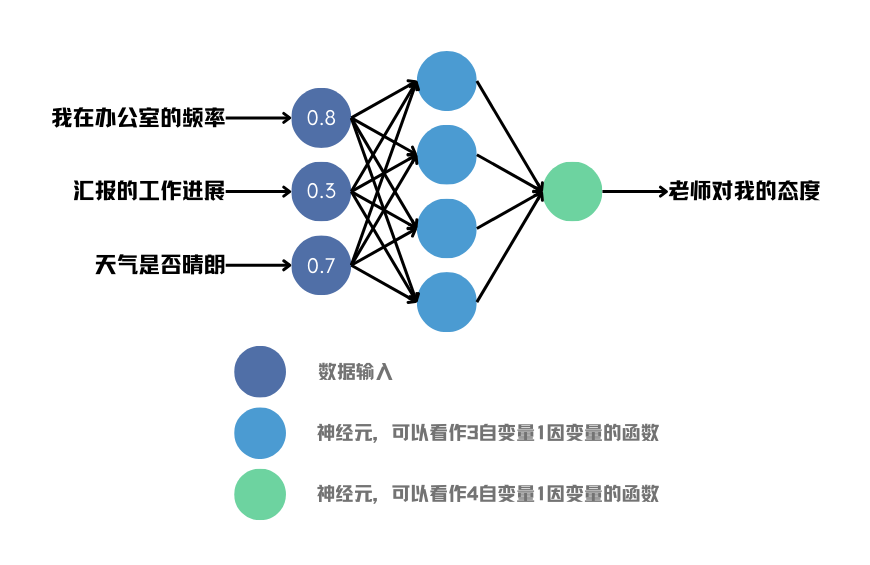
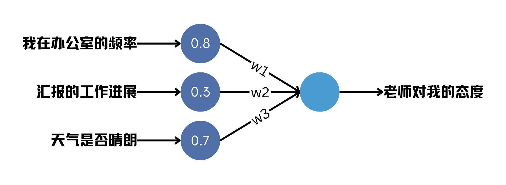

# 第3节 用模型学习数据中的知识


**本节导读**

在用神经网络解决我们的问题之前，有必要对它先有些基本的了解。读完本节，你将会明白：

* 神经网络的工作原理
* 如何训练神经网络


## 用神经网络解决一个简单的现实问题

在AI领域，神经网络鼎鼎大名，但对于非AI从业者来说，它就像一个神奇的黑箱子，没人知道里面到底发生了什么。

本来，我们应当闲言少叙，直接尝试用神经网络解决AI写诗的问题。但不得不承认，文本处理对AI来说是一个相当复杂的任务，硬着头皮啃下去容易消化不良。本书是写给初学者的，我们有必要用一节内容来聊清楚神经网络到底是怎么回事，再回归主线也不迟。

先来看一个简单但很现实的问题。

读研究生的同学可能有过这种感觉，就是不知道什么时候会得到导师的表扬，也搞不清楚什么情况下会挨骂。小王同学为此吃了不少苦头，他决定找出其中的缘由。但导师的脾气阴晴不定，他发现并没有哪种因素可以决定导师的心情，似乎是各种原因交织在一起产生的结果。他相信导师不会无缘无故批评别人，这里面一定暗藏玄机。

小王向我请教，我告诉他，你老师的心情肯定是一个非线性系统，你可以用神经网络来拟合这个系统。具体做法很简单，先列出你自己认为可能存在的影响因素，然后每天把这些因素记录下来，同时把老师当天的心情也记录下来。连续记录一个月，你就有了30条训练数据。接下来，写程序创建一个神经网络，用这些数据训练这个神经网络。到了第31天，你再用这个神经网络预测一下老师的心情，看跟实际结果能不能对的上。小王觉得这个主意非常科学，屁颠屁颠地开始着手实现。

他设计了一个三层神经网络。从第一层输入三个数，代表他认为比较重要的三个影响因素，分别是在办公室的频率、汇报的工作进展以及天气是否晴朗。我们姑且不评价这三个因素选的是否合适，小王既然这样选了自然有他的道理。每个输入都用0\~1之间的小数表示：

* 在办公室的频率为0表示完全不去上班，1表示一天到晚一直在办公室呆着。
* 汇报的工作进展为0表示完全没有进展，1表示远超预期进度，0.5表示符合预期。
* 天气为0表示大雨，1表示万里无云的晴天。

这三个数输入给第二层的四个神经元，计算得到四个结果。这四个结果再输入给第三层的唯一一个神经元，最后的输出用于判断老师的心情是好还是坏。当然，最后的输出也是一个0\~1之间的数，0表示小王会被老师大骂一顿，1表示老师对小王和蔼可亲。

<figure><figcaption>
图4 小王用来预测老师心情的神经网络模型
</figcaption></figure>

图中，每个深蓝色圆圈代表一个输入维度，也就是三个数，每个淡蓝色圆圈和绿色圆圈代表一个神经元。淡蓝色和绿色的区别是，前者位于中间层，后者位于输出层，淡蓝色的输出是绿色的输入。

我们可以看到，每个淡蓝色圆圈都被三个箭头指着，意味着它具有三个输入。淡蓝色圆圈的右侧有一条箭头指向绿色圆圈，这代表它的输出。因此，淡蓝色神经元其实就是一个“三输入一输出”的函数。像图中这样，如果不指明函数的实际形式，我们可以认为，神经网络其实是定义了一个结构框架。在这个框架下，不同的神经元函数可能具有不同的效果，但它们在网络结构的层面上是相同的。对于一个复杂的神经网络来说，结构往往比单个神经元更重要。

当然，对于小王来说，他肯定要用一个具体的函数。最流行的选择就是对输入加权求和，然后截断负值。虽然我很讨厌公式，但还好这里只用到了初中数学，读者应该能够理解。

$$
f(x_1, x_2, x_3) = \max \left( 0, w_1 x_1 + w_2x_2+w_3x_3 \right)
$$

x1,x2,x3代表函数的三个输入，它们分别与自己对应的权重w1,w2,w3相乘再求和。如果和大于0，那么输出这个数；如果和小于等于0，则输出0。不过等等，权重是哪来的？

在神经网络中，权重既不是输入，也不是常数，而是依附于神经元的可训练参数。可以说，权重是神经元的记忆。就像人通过学习记住知识一样，神经网络通过“学习”输入数据，将数据中蕴含的知识内化到这些权重中。这个过程就称为训练。

你可能会问，这个函数为什么设计成这样呢？简单来说，科学家们发现，将线性运算（加减乘除）与非线性运算（比如max）的组合作为运算单元，按照神经网络的结构扩展，理论上可以拟合任何复杂的函数。而这里使用的加权求和与max操作是最简单也被证明最有效的一种。可以想象，用计算机编程实现这个函数或许只需要一行代码，且计算量极低。

紧接着的问题是，训练是如何实现的呢？

这是一个大问题，也触及了AI的核心。巧在，2024年诺贝尔物理奖得主Hinton正是训练算法——反向传播的核心贡献者，这是一种训练神经网络的重要方法。借助小王的例子，我们一起看看如何使用反向传播实现模型的训练。

## 反向传播训练模型

前面的案例提到，我要求小王连续30天收集输入和输出的数据。输入是三个维度的值，输出是老师的态度。所谓的训练，其实就是想办法调整神经网络的所有参数，让输入经过一系列函数处理后恰好得到预期的输出。

为了说明我们的目的，假设小王收集到的一条数据如下

> 我在办公室的频率: 0.8\
> 汇报的工作进展: 0.3\
> 天气是否晴朗: 0.7\
> 老师对我的态度: 0.6

我们希望在输入前三行的情况下，让神经网络输出第四行。这个过程也称为预测。输出越接近实际值，模型预测的就越准。对于小王来说，他需要的就是一个能精准预测老师态度的模型。

要想揭开训练算法的原理，图4的两层模型还是有点复杂。为了方便理解，我们索性只用一个神经元，如下图所示。这次，神经元的输入箭头上添加了权重参数的标记。

<figure><figcaption>
图5 单神经元的神经网络
</figcaption></figure>

首先，我们给权重赋予一个初始值，比如让w1=w2=w3=1。注意，这个值是随便取的，它并不会影响最终训练的结果。此时，根据前文的公式，我们可以计算出神经元的输出。

$$
\begin{align*}
f(0.8, 0.3, 0.7) &= \max \left(0, 0.8w_1 + 0.3w_2 + 0.7w_3 \right) \\
&= \max \left( 0, 0.8 \times 1 + 0.3 \times 1 + 0.7 \times 1  \right) \\
&= \max \left( 0, 1.8 \right) \\
&= 1.8
\end{align*}
$$

这个结果显然离期望的0.6差得有点远，但没关系，我们接下来就调整权重，让输出更接近0.6。为了实现这个目标，我们将实际输出与0.6之间的差距记作loss（损失），将其定义为两者差值的平方。

$$
\text{loss} = \left( f(x_1, x_2, x_3) - 0.6 \right)^2
$$

之所以对差值求平方，是为了保证loss是个正数，这样的话loss就必然存在一个最小值0。无论初始状态下实际输出大于0.6还是小于0.6，我们都希望优化的方向是接近0.6。

你可以把优化想象成下山的过程，海拔代表loss。从山上的某一点出发，选择合适的方向前进，最终抵达最低点。而w1,w2,w3就如同山间不同方向的岔路，你需要精心选择在哪条路上前进多远，才能最终抵达山脚。

对人来说，看一眼就知道哪条路下山最快，因为我们很容易判断路的坡度。这个技巧在训练模型时仍然适用，我们可以看看模型在w1,w2,w3这三个方向上的坡度各是多少，然后沿着下行的方向前进即可。对于函数来说，坡度被称作梯度（gradient），更通俗一点说，其实就是导数。令函数分别对w1,w2,w3求导，导数的反方向就是函数值下降的方向。以下是求导的过程，里面用到了复合函数的链式求导法则。如果你搞不太清楚也没有关系，接着往后读便是，不必在意这些细节。

$$
\begin{align*}
\frac{\partial \text{loss}}{\partial w_1} 
&= \frac{\partial \text{loss}}{\partial f} \frac{\partial f}{\partial w_1} \\
&= \frac{\partial \left(f - 0.6\right)^2}{\partial f} \frac{\partial \left( 0.8*w_1 + 0.3 * w_2 + 0.7 * w_3 \right)}{\partial w_1} \\
&= 2 \times \left( f(0.8, 0.3, 0.7) - 0.6 \right) \times 0.8 \\
&= 2 \times (1.8 - 0.6) \times 0.8 \\
&= 1.92 \\
\frac{\partial \text{loss}}{\partial w_2} 
&= \frac{\partial \text{loss}}{\partial f} \frac{\partial f}{\partial w_2} \\
&= \frac{\partial \left(f - 0.6\right)^2}{\partial f} \frac{\partial \left( 0.8*w_1 + 0.3 * w_2 + 0.7 * w_3 \right)}{\partial w_2} \\
&= 2 \times \left( f(0.8, 0.3, 0.7) - 0.6 \right) \times 0.3 \\
&= 2 \times (1.8 - 0.6) \times 0.3 \\
&= 0.72 \\
\frac{\partial \text{loss}}{\partial w_3} 
&= \frac{\partial \text{loss}}{\partial f} \frac{\partial f}{\partial w_3} \\
&= \frac{\partial \left(f - 0.6\right)^2}{\partial f} \frac{\partial \left( 0.8*w_1 + 0.3 * w_2 + 0.7 * w_3 \right)}{\partial w_3} \\
&= 2 \times \left( f(0.8, 0.3, 0.7) - 0.6 \right) \times 0.7 \\
&= 2 \times (1.8 - 0.6) \times 0.7 \\
&= 1.68
\end{align*}
$$

我们直接用原本的w1,w2,w3减去它们的导数值，即往导数相反的方向走一步。新的w1,w2,w3为

$$
\begin{align*}
w_1 &= w_1 - \alpha \frac{\partial \text{loss}}{\partial w_1} \\
&= 1 - 0.1 \times 1.92 \\
&= 0.808 \\
w_2 &= w_2 - \alpha \frac{\partial \text{loss}}{\partial w_2} \\
&= 1 - 0.1 \times 0.72 \\
&= 0.928 \\
w_3 &= w_3 - \alpha \frac{\partial \text{loss}}{\partial w_3} \\
&= 1 - 0.1 \times 1.68 \\
&= 0.832
\end{align*}
$$

其中，α=0.1被称为学习率，是一个控制步长大小的常数。大部分时候，虽然我们找到了下降的方向，但沿着这个方向不宜走得过远。地势时常在变化，现在看起来下山的方向走过了头有可能又变成了上山。所以，我们应该小步走，每走一小步就重新计算一下新的下山方向，这就是优化的原理。

现在，让我们验证一下新的w1,w2,w3是否真的让结果更接近0.6了。

$$
\begin{align*}
f(0.8, 0.3, 0.7) &= \max \left(0, 0.8w_1 + 0.3w_2 + 0.7w_3 \right) \\
&= \max \left( 0, 0.8 \times 0.808 + 0.3 \times 0.928 + 0.7 \times 0.832  \right) \\
&= \max \left( 0, 1.5072 \right) \\
&= 1.5072
\end{align*}
$$

果然，函数值从之前的1.8变成了1.5072，向0.6靠近了一步。如果不断重复这个流程，理论上函数的结果就可以越来越接近0.6。不过我们在这里打住，大家只要感受到优化的过程就行了。

实际上，这里演示的是一个究极简化的版本，只有一个神经元，loss也是简单的欧氏距离。但无论怎样复杂的模型，都是由一层一层神经元组合起来的，本质上是一层又一层嵌套的函数。根据链式法则，只要函数定义清晰，总能求出loss关于每一个参数的导数，那么就可以据此更新每个参数。

在大模型中，参数量以亿计数，但最底层的原理仍然如此。只不过，当模型复杂之后，为了提高计算效率，人们想出了各种奇思妙想来加速优化过程，反向传播就是其中的代表。通俗来说，优化参数往往是从离loss最近的神经元开始，直到输入层，正好与模型实际的计算过程相反，所以把它叫做反向传播。

至于为什么要从离loss最近的神经元开始，这涉及到链式法则自动求导的过程，我们就不展开讲了。总之，我们只需要知道，根据实际输出和期望输出，运用求导等方法可以找到使loss下降的方向，从而迭代地优化整个模型。

为了讲清楚模型训练的过程，我们稍微偏题了一会儿。现在，还是赶快回来关心一下小王。

按照我的要求，小王每天收集数据，30天过后，开始训练模型。模型训练完毕，第31天，小王终于可以尝试用模型预测老师的态度。后来，我没有再联系他，他也没有再找我。预测的准不准我们无从得知，但我猜是准的，因为据说他们实验室的老师后来性格收敛了许多，这里面大概有小王的功劳。

## 回归主线任务

小王的例子让我们可以一窥神经网络的内部机制，现在是时候回到我们的主线任务——制作写诗AI了。

不妨借鉴一下小王对神经网络的设计思路，你会发现，他其实针对自己的问题设计了合适的模型结构。比如，如果小王认为有4个因素都很重要，那么输入就要变成4个，输入到中间层神经元的连接就会变得更多，每个中间层神经元需要变成4自变量1因变量的函数。此外，中间层神经元的数量其实是任意的，可以选择3个、4个乃至10个、20个。但不同的选择会导致不同的效果，至于几个更好，在试验之前是很难说的。这也说明了AI是一个实验科学，试过了才知道好不好用。

那么，这种模型结构能不能套用到我们的数据上呢？

让我们对比一下两者的差异。小王的输入只有3个数，非常简单直接，而且每个数都有明确的含义。而我们的输入则比较奇怪和复杂，字数不固定，而且每个字对应的是一个编号，这个编号其实没有明确的含义，你不能把它解释成一个频率或概率，或任何现实世界的概念。如果不管三七二十一，强行把我们的输入替换到小王的输入，下面这两个问题会变得难以解决：

* 首先，每条数据的输入长短不一，有的字数多有的字数少，这就导致无法设计一个稳定的网络结构来接收任意长度的数据。
* 其次，我们的输入是0\~8547之间的整数，但相邻的整数并不意味着相邻的这两个字具有相似性。相比而言，小王的输入在0\~1之间的变化具有更连续的含义。

看来，小王的案例虽然有所启发，但并不能直接套用。我们可能需要一些更复杂的解决方案来应对写诗AI的挑战。
