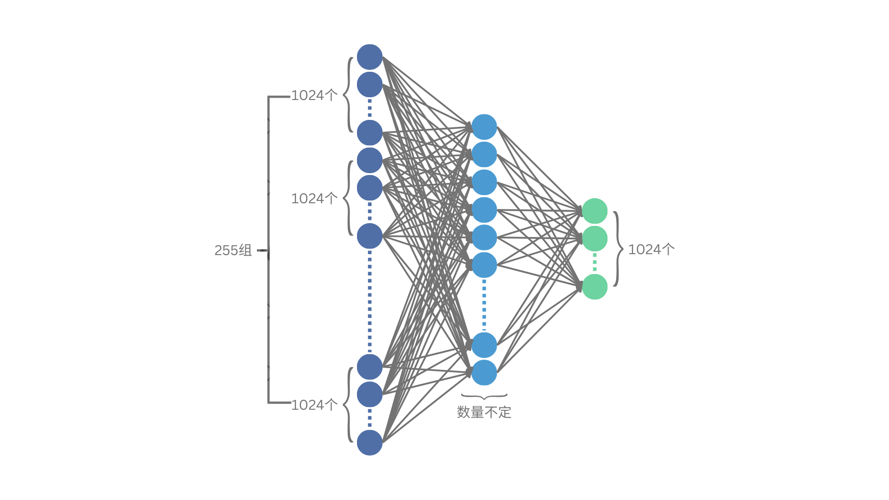

# 第4节 语言建模之难


**本节导读**

针对具体问题设计合适的神经网络结构时常是个困难，不仅需要经验，有时还需要灵光一现。在尝试设计写诗AI的时候，我们就遇到了巨大的难题。读完本节，你将会了解：

* 写诗AI的困难到底是什么
* 如何让文字输入变得有意义
* 面对长度不定的文本，我们该怎么办


## 高维语义空间

上节末尾，我们发现写诗AI无法直接套用小王的方案。第一个原因就是输入数据没有明确的物理含义。

回想我们自己，当我们读到一个字时，几乎瞬间就能明白它的含义。整个过程甚至是下意识的，仿佛大脑中隐含着一个“字典”，一看到这个字就能立即跳转到其解释。但此“字典”非我们前面提到的字典。在[第2节](di-2-jie-cong-yi-ge-shi-ji-an-li-ru-shou.md)的字典里，我们只是做了简单映射，把字转换到了ID，但大脑的“字典”则会更进一步，把字转换成它的含义。我们尚不知道这种含义如何在大脑中存储和表示，但我们可以肯定地说，它一定不只是一个简简单单的ID。

从数学的角度上看，任何事物都可以用数字表示。ID可以用数字表示，事物的含义其实也可以用数字表示。不过，当我们用数字表示含义的时候，它必须具有内在价值，或者说存在物理解释。比如，用摄氏度表示温度，每个数字都与具体的物理世界相关联，0℃正好对应着冰的熔点。这种物理解释将数字本身的性质与物理现象统一起来，越小的数代表越低的温度，而且温度变化和数字变化的规律是一致的，也就是说，数字加减乘除的结果仍然可以解释温度变化，于是对温度的研究就可以转化为数学运算。

回到文字上，文字的含义其实也存在物理解释，在大脑中，这种解释可能是神经元突触间特定的激活模式，只是我们不十分了解这一过程。既然如此，不如由我们自己来创造一个物理解释，来捕捉文字的内涵。

首先，文字的含义本质上是信息。信息是一个很广的概念，任何事物，实在的或抽象的，都可以认为是信息。信息产生的目的是方便人们沟通，比如，当我说“我很渴”的时候，你就能想到我需要喝水。“渴”和“水”这两个字虽然一个抽象一个具体，指向不同的事物，但它们之间有着紧密的联系。本质上，这种关联衡量了事物之间的相似性，而整个世界恰恰是由相似性联结起来的。你可以试着想象，如果任何事物都和其它事情毫无关联，我们该如何理解这个世界。

那么，以相似性为基础，我们应该让相似的字用相似的数来表示。就像温度一样，相近的温度对应的数值应该更接近。但对文字来说，这个要求很难满足，因为字和字之间的相似性不是单调排列的。如果我们说“渴”和“水”含义相近，这种相似体现在动物的生理行为层面，渴了就需要喝水。同时，我也可以说“水”和“油”相似，因为它们都是液体。但由此并不能说明“渴”和“油”相似，因为渴了并不应该喝油。于是，这种相似性的排序会成为巨大的难题。我们不可能在一条数轴上安排好所有字的合适位置，换句话说，我们不能用一个数来代表一个字。

谈到此处，你或许对我的意图有所察觉——我们应该用多个数来表示一个字。如果用两个数表示一个字，就意味着把所有字安排在二维平面上。如果用三个数，就意味着把所有字安排在三维空间中。然而，即使是三维空间也仍然不够用，它不足以区分文字内在的微妙含义。可以想象，几维空间就意味着我们需要在几个层面上把所有字排好序。然而，任何一个字恐怕都包含了不止三重含义，所以三维是不够的。

继续升维，就进入了所谓的高维空间。我们不如一步到位，选一个很高的维度，以免不够用，假设是1024维。用1024个数来表示一个字，每个数代表某个特定层面的微妙含义，估计是够了。

不过，我们如何定义每个维度的含义呢？很显然，我们定义不了，也根本不知道该如何找出1024种微妙的解释。但没关系，别忘了我们有神经网络。就像在小王的例子中，他事先定义好了输入的维度和每个维度的解释，然后交给神经网络处理。实际上，我们也可以不定义每个维度的解释，只是告诉神经网络输入维度是1024，让它通过学习数据来自己探索和发现每个维度的意义。

但没有解释的话，输入的这1024个值如何确定呢？

既然我们已经决定让模型自己学习每个维度的解释，那索性每个维度的值也交给模型学习就好了。一开始，我们只需要设置1024个随机值，模型在训练的过程中自然会明白如何合理地拆分字的含义，将其融入这1024个维度中，让数值与字的含义相匹配。

为了更方便理解，我们把[第2节](di-2-jie-cong-yi-ge-shi-ji-an-li-ru-shou.md)的输入数据拿过来试试。一开始，输入输出的文本长这样：

> **Input**: 白日依山盡，黃河入海
>
> **Output**: 流

紧接着，它们被转换为：

> **Input**: \[4403, 2704, 345, 1642, 4450, 8347, 8252, 3407, 536, 3503]
>
> **Output**: 3486

然后，就到了本节介绍的操作，把每个ID转换为一个1024维的向量。大概长这样：

> **Input**: \[
>
> \[0.0248, 1.0818, 1.0172, -2.5224, ...(省略1020个数)],
>
> \[0.1242, -0.2566, -0.0985, -0.0295, ...(省略1020个数)],
>
> ...(省略8行)
>
> ]
>
> **Output**: \[-0.4783, 0.4503, -1.5498, -1.3663, ...(省略1020个数)]

可以发现，每个数都在0附近不大的范围内。事实上，这些随机数是以0为均值、1为方差采样得到的。这样做可以保证输入局限于一个合理的区间，不至于太大或太小。

不过，你可能仍然会感到迷惑，输入都是随机数，输出也是随机数，那模型到底在学什么呢？

能想到这个问题，说明你关注到了重点。这里的随机1024维向量并不是在每次输入时生成的，而是在创建字典时生成的。也就是说，每个向量唯一对应于字典中的一个ID，字典被扩展成了一个巨大的表格。

| ID   | Embedding                                  |
| ---- | ------------------------------------------ |
| 0    | \[0.1236, -2.1807, 0.3700, 0.4144, ...]    |
| 1    | \[-1.2415, -0.1413, -0.5798, -0.3694, ...] |
| 2    | \[-0.3648, -0.9364, -0.8821, 0.2193, ...]  |
| ...  | ...                                        |
| 8547 | \[0.5925, 0.7216, -0.3418, 0.5955, ...]    |

对于任何输入文本，文本中的每个字都查表得到其对应的向量。虽然训练的时候模型会调整向量的值，但特定的向量始终和特定的字绑定。模型虽然表面上在学习向量之间的关系，但实际上学到的是向量绑定的字之间的关联。


这种高维且内化了特定语义的向量通常被称作embedding，原意是“嵌入”，引申为将含义内嵌在向量空间中。


现在，输入终于变得有意义了，但另一个问题接踵而至。

## 序列的难题

新的问题正是上节末尾提到的第一个困难——输入文本长短不一。

输入数据的语义化并没有改善这个问题，反而让它变得更复杂了。原本，我们面对的困难是，输入字数在1\~255之间变化。现在可好，输入变成了1×1024\~255×1024，范围扩大了许多。如果仿照小王的思路设计神经网络的话，对于字数为255的情况，模型就会长下面这样。

<figure><figcaption>
图6 所有字的1024维向量首尾相连作为神经网络的输入
</figcaption></figure>

其中，输入层把所有文字的1024维向量全部排成一排；中间层数量可以任意设置，但一般不会和前后层差距过大；输出层输出1024个数。输出的这1024个数也被当作一个字，将其与目标输出的1024维向量对比，优化它们的差距即可。

理论上这样做可行，但我们其实很容易看到其中潜在的问题。

一方面，这种做法似乎泯灭了每个字的独立性，把它们全部混在一起了。另一方面，输入层和中间层的连接变得密密麻麻。连线的数量等于输入神经元的数量乘以中间层神经元的数量，这会是一个相当大的数字。我们并没有规定中间层神经元具体是多少个，但按照经验，相邻层的神经元数量不宜相差过大，所以整个神经网络的计算量将会放大约1024²倍。

有没有办法改善这两个问题呢？

或许我们可以尝试把每个字的1024维向量明确分开，以组为单位进行处理，像下面这个样子：

<figure><figcaption>
图7 神经网络的每一层都以组的单位接收或处理数据
</figcaption></figure>

的确，在这个处理下，连线变得非常稀疏，好像又回到了最初使用ID输入的模式，只不过每个输入现在不是一个ID，而是一个1024维的向量。

虽然看起来很清爽，但实际上，图7的结构并没有说清楚数据是如何在神经元之间传递的。在图6中，每条箭头明确地代表一个数，中间层神经元接收到几个箭头，它代表的函数就有几个自变量。而图7中间层的一组神经元接收来自输入的255组神经元的数据，具体每个神经元接收到哪些数据，图中并没有说明。也就是说，图7中的连接定义了一种开放的模型结构，它只规定一组神经元连接到另一组神经元，但具体组的内部如何处理这些数据，可以有不同的实现方式。

至于怎样实现最好，下节就来揭晓答案。
