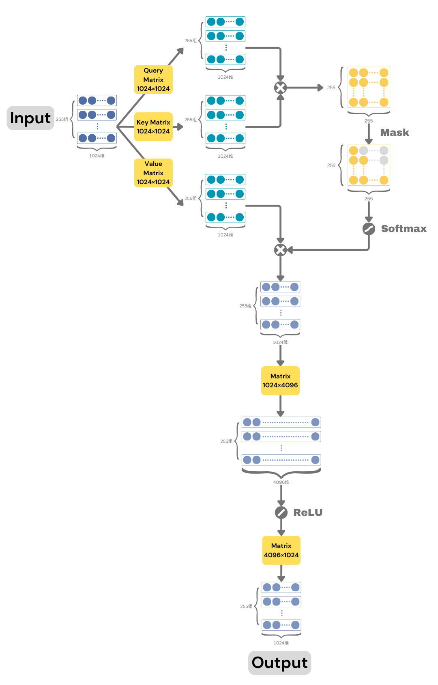

# 第6节 尊重逻辑，拒绝作弊


**本节导读**

从最初的注意力机制到完善的Transformer架构，仍有一系列问题尚待解决。回顾人类自身，或许可以说，逻辑和理性是人被称为高等智慧的关键。然而怎样才能教会模型逻辑思维呢？读完本节，你将会了解：

* 注意力机制的完整版本
* 如何在数据中引入因果性
* Transformer的网络结构


## 对称性缺陷

上节的最后一个版本引入了可训练参数，从而让注意力权重有了更多可能性。但请注意，图10中间行所代表的计算与前一个版本并无区别，都是矩阵乘以它自身的转置，即

$$
W = X^{\prime} X^{\prime T}
$$

只不过输入矩阵从X变成了X'。这种计算方式得出的结果有一个术语，叫“自相关矩阵”，因为它记录了矩阵X与其自身的相关性。回顾图10的中间行，可以看出是X的任意两个行向量之间的相关性。

这种自相关有一个致命的缺陷——它是对称的。原因也很容易理解，向量i与向量j的相似性等同于向量j与向量i的相似性，余弦相似度不区分谁在前谁在后。但结合我们的实际场景，字与字之间的注意力需要这个对称性吗？

从生活经验的角度考虑，答案当然是不需要。请读者不要忘了，语言是有顺序的。一个词正着说和倒着说往往会表达截然不同的意思。一个词对出现在它后面的另一个词很重要，不代表后面那个词对这个词也同样重要。对称性会削弱我们对文字的理解，因为许多微妙的情感正是蕴含在不对称之中。我们需要想办法打破此间的对称性。

审视上面的公式，我们或许可以想出两种办法来避免对称的结果。

第一种方法关注输入。前面提到，X'乘以自己会得到自相关矩阵，那我们可以避免让它乘以自己。既然X'是通过一个参数矩阵M变换得到的，那干脆再拿另一个参数矩阵M2变换得到X2'，然后让X'和X2'相乘得到W，以此打破对称性。计算过程如下式所示。

$$
X^{\prime} = MX \\
X_2^{\prime} = M_2X \\
W = X^{\prime} X_2^{\prime T}
$$

由于参数矩阵M和M2都是模型参数，它们在训练过程中会积累有用的经验，几乎不可能同步变化，所以X'和X2'必然不同，相乘得到的W显然也就不具有对称性。

第二种方法：关注输出的W矩阵。既然W的左下角和右上角对称，不如我们只用左下角，右上角直接扔掉。这个方法初看有点邪乎，但其实充满洞见——它不仅可以抹除对称性，更是会大幅提高模型的逻辑推理能力。不过，这又是怎么一回事？

<figure><figcaption>
图11 W矩阵的作用效果
</figcaption></figure>

让我们在图11中重新审视W每个元素的含义。可以发现，第i行第j列的w元素代表叠加多少权重的向量j到向量i上。比如，根据矩阵运算法则，图中黄色的W\[3,1]只会与X'\[1]这一行相乘，其结果只会影响右侧的X''\[3]。也就是说，W\[3,1]体现了向量X'\[1]对向量X''\[3]的影响力。当然，X'\[1]并非只影响X''\[3]，它还可以通过W\[2,1]影响X''\[2]。同理，X''\[3]也并非只受X'\[1]影响，它还可以通过W\[3,2]被X'\[2]影响。理解了W矩阵每个元素的作用，我们再来考虑左下角的真正含义。

一个显而易见的事情是，W的左下角元素有一个共同特征，它们的行数都大于列数。这一现象其实有一个颇具现实意义的解释。在注意力机制中，我们把X'称为参考向量，把X''称为当前向量。当前向量的下标总是大于参考向量的下标，意味着当我们搜寻注意力的时候，我们只能往左看，而不能往右看。有没有体会到其中的道理？人说话其实就是如此，我们只能参考已经说出的话来决定下一个字，而无法参考未来将要说出的话，否则就违反了因果性。

虽然我们从W的对称性引出了这两种方法，但事实上它们的作用比想象中更大，因为两者通常会同时使用。

在实际的注意力机制中，除了使用M和M2处理输入得到X'和X2'外，还额外增加了第三个变换矩阵，用于最后与权重矩阵W相乘。为了清晰说明这三个矩阵的作用，研究者给它们起了响亮的名字，分别是Query、Key和Value。Query矩阵对应于我们这里的M，Key对应于我们的M2。这三个名字直观地表达了它们各自代表的含义。经过Query变换后的向量在计算W的时候作为左操作数，代表了正在搜寻注意力的当前向量，因此使用Query（查询）一词。同理，经过Key变换后的向量在计算W的时候则作为右操作数，代表了被检视的参考向量，只有关键（key）信息才会被当前向量注意到。新增的Value变换则决定具体哪些有价值（value）的信息会从参考向量叠加到当前向量上。这三个参数矩阵使得模型可以学到更多更复杂的知识，并有能力拆分注意力的各个方面，可以说相当精妙。

而方法二增加的因果限制则彻底让注意力机制成为主宰语言模型的关键。试着想象，如果任何一个字都既可以参考前面的字又可以参考后面的字，它的向量就包含了许多来自未来的信息。然而实际应用的时候，模型显然要一个字一个字地输出。待预测的字只能包含所有出现在前面的信息，不可能事先看到后面未输出的内容，否则它岂不成了先知？所以在训练的时候，我们也应该保留这个性质，不让模型看到后面的字，不然，在训练的时候作弊偷看答案，到了真正使用的时候就会手足无措，一派胡言。其实，从根本上来讲，我们的语言就是包含因果性的，所以如果在训练时不限制因果性，模型就有可能在使用时表现不佳。这个因果性最终会体现为语言的逻辑，从已知内容推断出未知，正是逻辑的意义。

## Transformer

至此，注意力机制的大部分知识都已就绪。把这两节介绍的所有内容放在一起，就形成了所谓的Transformer网络结构。我们对照下图，看一看宏观上Tranformer到底在做什么。

<figure><figcaption>
图12 Transformer网络结构
</figcaption></figure>

从图片的左上角开始，输入的255个字表示为255个1024维向量。这些向量经过Query、Key和Value矩阵后扩展成三份，但各自仍然是255个1024维向量。如前文所说，它们代表了不同的含义。Query和Key处理后的向量会先计算相似度，得到右上角所示的权重矩阵，然后将矩阵的右上元素全部置零，以维持因果性。

接下来是一个前文未提到的操作，对权重矩阵施加softmax函数。效果是让每一行的数加起来和为1，相当于把原始的相似性大小转变为一个概率。在概率视角下，我们就能确定叠加多少比例的参考字向量到当前字向量，于是注意力机制有了更清晰的物理含义。

Value分支与softmax之后的权重矩阵相乘，就得到结合了注意力的一组字向量。这组向量的维度和输入完全一致，可以认为原始的每个字向量摇身一变，虽然身份还是代表那个字，但内在增添了许多对周围其它字的理解。

再往下，则是一串典型的传统神经网络结构，被称为前馈神经网络（Feedforward Neural Network, FFN）。先经过一个1024×4096的矩阵变换，将每个1024维字向量转换为4096维字向量。然后经过一个ReLU函数，将负数重置为零。ReLU看起来简单，但没它还真不行，它引入的非线性是神经网络超强拟合能力的关键。最后，使用一个4096×1024的矩阵将每个4096维字向量再变回1024维。没错，最后的输出仍然是255个1024维向量，好像实现了一次轮回。

整个过程中，注意力计算是大模型成功的关键。正是注意力机制让AI可以有选择地结合上下文，使每个字的内在表示变得更丰富。但我们也不能忽略后面的前馈神经网络，特别是其中先升维再降维的操作。与注意力机制不同的是，前馈神经网络中的两个线性变换针对每个字向量单独操作。换句话说，只用一套参数处理所有字向量。我们可以把注意力机制和这里的线性变换层看作互相独立的两个步骤。注意力机制注重字和字之间的关系，但并不十分在意字向量本身含义的变化。诚然，字向量在注意力机制前后肯定是变化的，但变化主要体现在对其它字信息的融合，而不是它自身含义的变化。

前馈网络则恰恰相反，由于只关注每个字向量本身，模型可以学会如何更好地在高维空间中表达字的含义。维度先升后降看起来有些奇怪，但可以这样理解。升维操作就好像让模型用白话文解释文言文，它自然能解释得更细致，同时获得更准确的理解。ReLU在它的白话文解释上切除那些负值，正如告诉模型你的解释里存在错误，被我好心修复了。而最后的降维操作则是再次把白话文解释压缩为简略的文言文，且含义在维度变化前后保持不变。这既能体现模型对文本含义的深刻理解，也利于降低计算量。

我们把以上的模型结构称为Transformer，寓意对文本含义的“变换”。


有趣的是，Transformer始终没有一个合适的中文翻译。“变换器”、“变压器”感觉都不是太对味。因此，文中会直接使用这个单词的英文原文。Transformer是动词transform（变换）的名词形式，可以理解为一种可以对数据做变换的装置。


不过，实际大模型中的Transformer和上图相比仍有一些差别，但不至于影响整体结构。这里简单提一下， 大家有点印象就好，不必关注细节。

* 一套Query、Key和Value通常被称为一个注意力头（attention head）。为了增强模型的能力，实际应用中，人们一般会创建多个注意力头，并在注意力机制的末尾合并每个注意力头生成的字向量。
* Query、Key和Value矩阵的列数不一定非要和输入向量一致。只需要保证注意力机制最终输出的字向量仍然与最初输入的字向量维度一致即可，各个中间结果的维度其实都可以自行调整。
* 注意力头和前馈网络建议采用残差连接。它的意思是，注意力机制最后输出的结果最好只是初始输出应该变化的量，这样就可以把输出和输入加起来作为完整的结果。这种做法始于经典的ResNet，人们发现学习残差比学习完整的向量更容易，因为改动只是原始信息的一小部分，记起来没那么困难。

需要提醒大家的是，Transformer只是一个架构，不是完整的模型。下一节，我们会介绍如何使用Transformer搭建完整的模型，并正式开始训练。
