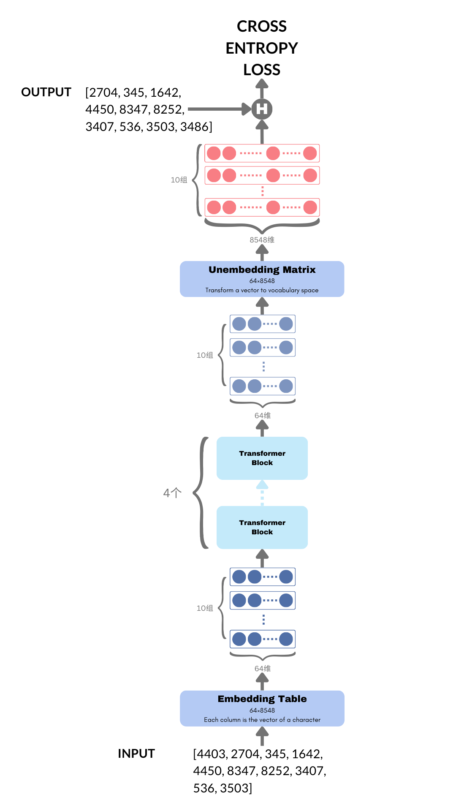

# 第7节 从智障到天才


**本节导读**

数据就绪，理论也弄清楚了，下一步就开始轰轰烈烈地训练模型吧。读完本节，你将会了解：

* 完整的训练流程
* 如何提高训练效率
* 从智障到天才——看看AI的诗作
* 为什么叫做预训练


## 完整的训练流程

本书前六节从准备数据开始，到设计出模型的基本结构，可以说走过了漫长但扎实的一系列步骤。在真正将transformer扩展为可训练的完整模型前，让我们回到最初的起点，纵览全局，看看我们是否仍朝着正确的方向前进。

在[第4节](di-4-jie-yu-yan-jian-mo-zhi-nan.md)的图7中，我们设计了一个大致的框架，输入255个1024维向量，经过中间层当时尚不清楚的处理方法，得到新的255个1024维向量，然后再将这255个向量通过另一种不清楚的方法合并为一个1024维向量。将最终的这个向量与预期的输出向量相比，优化它们之间的差距。

后来，我们逐渐摸索出注意力机制，于是中间层就可以用transformer架构来实现。细心的读者或许已经发现，transformer的输入与输出维度完全一致。这呼应了当时我们的设计，使多层transformer叠加成为可能。

但我们始终没有谈到如何处理最后一层的输出，如何从255个1024维向量变成1个1024维向量？

如果坚持使用与字数无关的参数量，这个问题似乎又变得异常困难。我们或许应该换个角度看问题，重新审视一下transformer输出的结果。

在注意力机制和因果性限制的前提下，每个字向量都融合了更靠前的其它字的信息。这不免让人怀疑，我们真的有必要用所有字向量来预测下一个字吗？既然最后一个字的向量融合了前面所有字的信息，直接用它预测不就好了。这样一来，直接取最后一个字的1024维向量作为结果，与期望的字向量求差并优化，不仅解决了参数量与字数相关的问题，甚至都不需要额外参数了。

的确，这是一个好方法，而且看起来更符合transformer的设计哲学。不过你可能会想， 这样一来前面那些字向量还有用吗？答案是有用。只用最后一个字向量不代表前面的字向量会失去价值。相反，由于注意力机制需要在字之间寻求依赖关系，每个字向量都对最后一个字有所贡献，它们缺一不可。

不过，这仍然有种浪费的感觉。前面的字向量最后难道完全没用了吗？其实还真不是。

那些位于中间位置的字向量也可以用来预测下一个字，在因果性的限制下，它本身也是一句话的末尾，只不过这句话更短，而且是另一段话的子句。其实早在[第2节](di-2-jie-cong-yi-ge-shi-ji-an-li-ru-shou.md)我们就谈及了这个问题，当时，我们把同一首诗按照输入长度的不同构建了多份数据。本质上，它们都是最长那份数据的子句，但为了让模型能学会从任意位置接话，这种多样性还是很有必要。

此时，再看这种方案我们就会发现其中巨大的好处。每个字向量如果都用来预测下一个字，不是正好可以对应于一个长句的所有子句吗？既然预测最长的那句必须同时计算出所有中间字向量，那不如顺便同时预测所有字向量对应的下一个字。对于长度为256的一段句子，我们可以将其拆分成长度从1\~255的子句，每个子句需要预测的正好是第2\~256个字。拿“白日依山盡，黃河入海流”这段短句作为例子的话，原本[第2节](di-2-jie-cong-yi-ge-shi-ji-an-li-ru-shou.md)设计的输入输出是

> **Input**: \[4403, 2704, 345, 1642, 4450, 8347, 8252, 3407, 536, 3503]
>
> **Output**: 3486

现在，我们将输出扩展成与输入相同长度的一组数，每个对应位置的输出恰好是输入位置的下一个字

> **Input**: \[4403, 2704, 345, 1642, 4450, 8347, 8252, 3407, 536, 3503]
>
> **Output**: \[2704, 345, 1642, 4450, 8347, 8252, 3407, 536, 3503, 3486]

如此一来，数据变得更加整齐，我们只需要规定最大长度N=256，然后每次取一段256个字的文本就行了，而不需要去拆分子句，效率大幅提高。

不过，经过这么一番变动，字向量的含义会被迫发生变化。本来，它一直用来表示当前字的内涵，因为我们期待最后额外用一层神经网络来根据这些字预测下一个字。但现在，字向量本身就要用来预测下一个字，那么它更应该被解释为代表下一个字的含义。我们可以把字向量从输入层到输出层的变化想象为一个连续的过程。最开始，字向量仅代表当前字的含义，而且与前文的其它字无关。经过一层又一层的transformer，字向量逐渐吸收其它字的信息，并转变自己的含义。在抵达最后一层时，它完全变成了最有可能出现的下一个字的含义。

至此，整个流程基本上确定了，但最后计算误差的方式其实尚未明确。虽然我们一直在说把实际输出的1024维向量和期望输出的1024维向量作比较，求它们之间的差距，但这只是一个直觉上的比喻，实际操作起来不太合适。原因是高维向量本身并没有物理意义，如果训练终结于此，在实际使用的时候，我们该如何将输出的1024维向量转换为文字呢？要知道，在已知字的情况下，查Embedding Table可以直接得到向量。但在已知向量的情况下，仅靠查表可是无法找到字的。

为了把从向量到字的流程彻底打通，我们需要在最后添加一个Unembedding层。它作为Embedding的反过程，将1024维向量解码到8548维空间。在这个等同于词典大小的空间中，我们可以认为每个元素都代表着该下标对应字的概率（不知你是否还记得，词典的每个字都有一个ID，这个ID正是此处8548维向量中元素的下标）。

有了每个字的概率，以及预期的真实ID，我们就可以将其当作一个多分类问题，计算交叉熵损失。通俗来说，交叉熵损失衡量了对多个类别的概率预测与真实类别之间的差距。交叉熵损失越小，说明概率的预测越接近实际值。


交叉熵损失是机器学习中的一个常见损失函数。所谓损失函数，就是用来衡量实际输出与真实输出之间差距的目标函数。我们在[第3节](di-3-jie-yong-mo-xing-xue-xi-shu-ju-zhong-de-zhi-shi.md)中曾经用差的平方来作为优化目标，那其实就是一个简单的损失函数。不过，交叉熵损失比较复杂，本书无意详细解释，读者只要知道，它可以衡量预测的概率分布与真实类别之间的差距就好了。


终于，我们打通了从输入到输出的全流程，是时候松口气了。让我们欣赏一下迄今为止的杰作。

<figure><figcaption><p>图12 TutorialLLM的网络结构</p></figcaption></figure>

让我对照上图，再完整介绍一下从输入到输出的全过程。

* 输入数据仍然是这一段——“白日依山盡，黃河入海”，对应的预期输出是“日依山盡，黃河入海流”，图中直接用ID表示文字。
* 输入的ID先经过一个Embedding Table，查表找出每个ID对应的64维向量。注意，前面讲解时我们一直说字向量维度是1024。但受计算资源限制，为了更容易在自己电脑上跑起来，我在代码中把维度降低到了64。Embedding Table的输出是10个64维向量，对应输入的10个字。
* 这组向量经过4个Transformer Block，输出仍然是10个64维向量。中间的过程想必读者已经了解，仍不清楚的同学可以回到前几节温习一下。
* 接下来，用一个Unembedding Matrix将每个64维向量变成8548维向量。8548维向量的每个元素预测了下一个字是该位置所对应字的概率。
* 最后，分别计算每个8548维向量与预期ID的交叉熵损失。将10个损失加起来作为总损失，并用反向传播算法优化网络参数。

当然，实现这整套流程的代码比我们文中的描述复杂许多，我们谈及的每一步都需要用Python语言并借助PyTorch精准实现，且常常需要反复调试。好在这个过程我已完成，为了不让本书变得过于繁琐，我们不在这里解读代码，只在[第10节](di-10-jie-dai-ma-shi-xian-zhong-de-zhong-dian-xuan-du.md)集中阐述一下代码实现的重点。此刻，我们一起看看实际运行的效果，感受模型训练的过程。

## 开始训练

训练过程中，每迭代100次，输出模型在训练集和测试集上的损失，并让模型以“春夜喜雨”开头写诗，写满256个字。我们预期损失值在两个数据集上同步下降，且写的诗质量越来越高。以下是部分输出片段。

```
Step 0, train loss 0.0000, evaluate loss 9.2029
Generate first 100 characters of poems starting with 春夜喜雨:
春夜喜雨墻鵷函媵分塏潏鍳母付菱莽换驃慚憮儲躕袗鯆溫沲芳罔窻倏菂弓匌莿尚茸茇培嵍鵝掣卵耽敧青魄叚𪆟瞑唱鄢懅齧泉綘躅鷂㦬烻超玃鯽敝俱惏廏鐐處翻矼奭媼悟出撾孃詠可碙媌鶂旐垤嵼鶤柘輩噇篲詮擲憇純絃蜘儔緬簇澎雨搰褚磐歙
Step 100, train loss 6.3026, evaluate loss 6.2829
Generate first 100 characters of poems starting with 春夜喜雨:
春夜喜雨剡冰 閒路。耕銅崔出玫胖，上惺尋。


樹天歸贈，。


強寥下戎景人。
火亂潔頴明戍流漸道一室勢。
摶磻四春相似
，年陽下了行爭癥追赤且木少塞是門相。
摘言迎來夢賦示營似吾首。
暮墜鬢纔征蕉春崖五牀

<Omit many iterations here...>

Step 5000, train loss 4.7134, evaluate loss 4.9221
Generate first 100 characters of poems starting with 春夜喜雨:
春夜喜雨發早，唯應尋與塵遠山。
尋敬況皆迷情重，見買腰量漢寒宵。

贈家石橋危師兼寄一題因作四使者池應制
梧桐葉朝廷塵，一曲鐘明冠黑。
西上國邀辭外，主詞高須禁圖違。
因循勢祿應承急，不知育符惟開。
舊玄元侍

<Omit many iterations here...>

Step 10000, train loss 4.3883, evaluate loss 4.6798
Generate first 100 characters of poems starting with 春夜喜雨:
春夜喜雨人掃轉，煙穗半開笑倚簷。
美酒飄生弱氈粉，記詩繫舊光桑榆。
鶯別夜悲行滿袖，簟前年態踏爲顏。
雲間葉絡長簾鉢，舊漏孤燈照水香。
尊容暮事黃雲伴，使我清光小舊狂。

重夜涼
自謂長安不速時，當來不得鷓鴣
```

可以看到，

* 当step=0时，模型还没开始训练，它的参数全部来自随机初始化，因此输出也完全随机，看起来就像智障一样。
* 当step=100时，模型开始尝试使用标点符号并换行，但用的乱七八糟，文字也没有任何含义。
* 当step=5000时，格式上终于有了起色，模型正在努力让每一行输出两句话，但每句话的长短仍不尽如人意。不过，我们可以发现，它的用词变得合理了许多，虽然仍然没有组成完整的句子。
* 当step=10000时，格式变得非常整洁，外观看起来像一首七言诗。细看每句话，能感到一丝韵味，仿佛学到了一点诗的精髓。但客观来说，它对语句的整体把握还是差了些，一方面押韵不成功，另一方面缺乏主旨，略显空洞。

如果观察训练损失（train loss）和测试损失（evaluate loss），会发现两者都在下降，但训练损失下降得更快。这很正常，因为我们把数据分成了两份，一份用作训练，另一份用作测试。由于优化算法始终只能看到训练集的数据，它优化的方向自然是让模型生成的结果越来越贴近训练集文本。训练损失越小，意味着模型的预测跟训练集中真实文本越接近。但跟训练集越接近，有时候可能在测试集上反而表现不佳，这种情况叫做“过拟合”。举个例子，语文课的初衷为了提高同学们的文学素养，但在考试题上过度优化就会导致过拟合现象。比如，为了作文能得高分，疯狂地练习议论文套路，用固定的格式、夸张的笔法、雄伟的事例把文章写得惊心动魄。虽然的确能得高分，但并不代表文学素养真的提高了。相反，几年过后，写散文、记叙文、小说的能力可能变得更差，因为思路被困在一个思维定势中跳不出来。如果此时向文学杂志投稿，大概率是有去无回。在这个例子中，高考作文是训练集，文学杂志是测试集。大脑在训练集上长期训练导致过拟合，从而无法适应测试集的环境，虽然本意并非如此。

总体来说，我们的结果并不完美，但第一次训练模型能取得这个成果已经相当不错，况且还是亲眼看着它在自己电脑上跑出来的。


本文提到的所有代码都可以在GitHub仓库[TutorialLLM](https://github.com/jingedawang/TutorialLLM)中访问。想要复现以上结果的读者，可以参考README中的使用方法。


我们把这套训练过程称为预训练（pretrain）。之所以叫“预”训练，意味着这只是训练的第一个阶段。在这个阶段，模型读遍天下文字，学会了语言的底层逻辑。可以说它掌握了语言的道，但术这方面还是空白。你会发现，预训练之后的模型只会不停地写诗，既不懂得何时停止，也不会听从我们的指令。下一节，我们将了解如何让模型听从我们的指挥，真正成为人类的工具。
