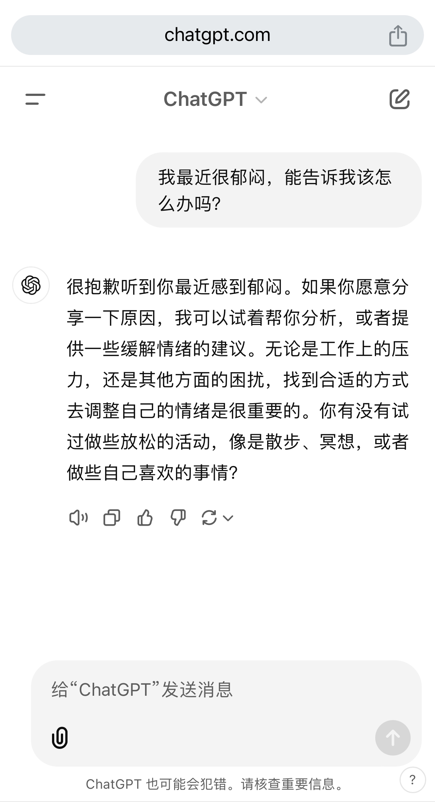

# 第8节 做一个听话的AI


**本节导读**

人们发明AI，是希望AI可以成为人类的助手。它不仅需要学会说话，更重要的是理解人的意图，听从我们的要求。读完本节，你将会了解：

* 对话AI的原理
* 如何教会AI根据题目写诗


## 文本补全 vs 对话

在贯穿全书的案例中，读者或许能够发现，训练数据的组织方式决定了模型的实际行为。之所以训练出的模型会一首接一首地写诗，是因为我们的训练数据就是这样设计的。在我们的数据集中，所有诗首尾相连串在一起，模型学习这些文本中的表述方式，自然也就学会了不停写诗。我们曾在[第2节](di-2-jie-cong-yi-ge-shi-ji-an-li-ru-shou.md)中提及，这种行为被称为文本补全（completion）。

对于OpenAI的GPT系列模型来说，预训练的结果也是不停地输出文字。假如你提出一个问题，模型大概率不会回答你这个问题，而是尝试模仿你提问的方式无休止地提出其它问题。当然，你可能说，ChatGPT可不是这样。的确，那是因为ChatGPT并不属于预训练模型，而是经过了指令微调（Instruction Fine-tune）的结果。这正是本节将要关注的内容。

现在，我们有了一个只会文本补全的预训练模型，如何才能把它变成能回答问题乃至对话的聊天模型呢？

其实，问答或聊天本质上也是文本，是双方各自讲话的集合。我们可以借鉴作家如何在小说里描写对话。通常，先提及说话者的名字，比如“某某说”，然后用引号引用说话的内容。如果对谈的双方很明确且一人一句，作者往往会忽略指示代词，直接展示对话内容。这种灵活的做法依赖于读者对上下文的了解，有能力分辨出每句话出自哪位角色。但实际上，有时候我在读某些作品时，对话的发起人并不那么明确，时常需要从头数一遍哪句话是谁说的。一旦认错了，很可能会曲解作者的原意。可见，对话的标识非常重要，无论隐式或显式存在。

考虑到AI的能力，让它自己判断每句话出自谁似乎有些为难。假如我们有了一个对话的数据，如果想让AI扮演其中一方，让它学会与另一方对话，我们就应该给每段话添加明确的标记，指明那句话出自谁。这样，当数据作为训练语料输入的时候，模型就有可能认清自己的角色，从而学会站在对话者的角度说话，而不是像之前那样自顾自地说个不停。为了更加清晰地说明这个过程，我们拿ChatGPT来举例。

我在ChatGPT的聊天窗口中问它

> 我最近很郁闷，能告诉我该怎么办吗？

它回复说

> 很抱歉听到你最近感到郁闷。如果你愿意分享一下原因，我可以试着帮你分析，或者提供一些缓解情绪的建议。无论是工作上的压力，还是其他方面的困扰，找到合适的方式去调整自己的情绪是很重要的。你有没有试过做些放松的活动，像是散步、冥想，或者做些自己喜欢的事情？

一问一答，一个典型的对话就完成了。当然，我可以继续追问，围绕这个主题不断和ChatGPT聊下去。用过的读者应该能够发现，在同一个聊天窗口中，ChatGPT会记得我们之前的聊天内容，并根据实际情况给出合理的答复。

<figure><figcaption><p>图14 向ChatGPT倾诉</p></figcaption></figure>

但问题来了，ChatGPT如何分辨对话的双方呢？从界面上来看，我的消息显示在右侧，ChatGPT的消息显示在左侧。至少，在App的层面对话双方是被清晰分开的。实际上，在程序的后台，每当我输入一句话后，这段话就会被打上user的标签，证明是用户输入的内容。而每次ChatGPT答复的内容，则会被打上assistant的标签。靠这两个标签，App得以正确地显示对话窗口。

事实上，除了对话的双方，ChatGPT中还存在第三个角色。这第三个角色使用system标签，规定AI所扮演的身份。比如，如果用户想要咨询心理问题，就可以用system标签让AI扮演一个心理咨询师。这个标签的内容独立于对话之外，无法在图14中看到。可惜的是，ChatGPT免费版并不支持自定义system标签，它提供了一个默认值，大概内容如下

> You are ChatGPT, a large language model trained by OpenAI.\
> Knowledge cutoff: 2023-10\
> Current date: 2024-11-30

如果想要自定义system标签，只能购买OpenAI API，在代码中调用API填写system的内容。

system标签和user标签指向的内容通常被称为prompt（提示词），意为用这些内容提示大模型使其生成所需的结果。


现在，专门有一个方向叫做prompt engineering（提示词工程），研究如何更好地向AI提问，才能获得期待的结果。提示词工程里面有许多有趣的经验结论，但也不乏玄学成分，感兴趣的读者可以自行了解。


不过，既然我们也在训练模型，我们更想知道的是，OpenAI是如何做到这种效果的呢？

正如开头所说，想要怎样的效果，就要用怎样的数据训练。OpenAI的数据团队会收集大量对话数据，按照对话顺序，整理成system、user、assistant的格式，然后用与预训练相同的方式继续训练模型。由于system和user中的内容通常是在指示AI做某事，培养AI遵循指令的能力，这种训练就叫做指令微调。

如果把刚刚我们与ChatGPT的对话作为训练数据，我会把数据处理成这样

> \[system]\
> 你是一个优秀的心理咨询师\
> \[user]\
> 我最近很郁闷，能告诉我该怎么办吗？\
> \[assistant]\
> 很抱歉听到你最近感到郁闷。如果你愿意分享一下原因，我可以试着帮你分析，或者提供一些缓解情绪的建议。无论是工作上的压力，还是其他方面的困扰，找到合适的方式去调整自己的情绪是很重要的。你有没有试过做些放松的活动，像是散步、冥想，或者做些自己喜欢的事情？

可以看到，system、user和assistant标签用方括号标识，放在其对应的一段话的开头。如果user和assistant继续对话，可以在数据的后面添加任意数量的user和assistant，但两者应交叉排布。我们期望模型在训练过程中渐渐明白这几个标签的含义，从而学会站在不同的角色下发言。

用大量这种格式的数据训练，模型就会明白如何根据输入的system和user内容来提供assistant部分的答复。当然，前提是训练数据质量够高，system的定义符合assistant所扮演的角色，assistant也正确回答了user的问题。

训练完毕后，只要输入包含system和user的前半部分，模型就可以输出assistant的后半部分，从而达到对话的效果。与预训练模型最大的区别是，对于任何用户的输入，模型会输出不同长度的回答。这些回答长度有限，而不是像预训练模型一样喋喋不休。当然，这种懂得终结回答的能力也来源于训练数据。正是因为我们用system、user、assistant明确定义了不同的角色，每个角色就只能根据自己的身份合理表达，有始有终。

## 指令微调

现在，回到我们的写诗场景。考虑可行性，我们选择一个容易学会的对话模式——根据题目写诗。这样的训练数据很多，我们可以把每首诗都整理成如下的格式：

> \<INS>請用以下題目寫一首詩\<INP>春夜喜雨\<RES>好雨知時節，當春乃發生。\n隨風潛入夜，潤物細無聲。\n野徑雲俱黑，江船火獨明。\n曉看紅濕處，花重錦官城。

注意，我们并没有使用ChatGPT所定义的system、user和assistant标签，而是自定义了一套INS（instruction）、INP（input）和RES（response）标签，分别代表指令、输入以及答复。一方面，这套新标签用到的字符更少，可以降低一些学习难度。另一方面，我们的命名更直接地表达了希望模型遵循指令的目的，方便大家理解。当然，由此可以看出，标签可以随便取，只要训练和使用时保持一致即可。

在我们的例子中，指令部分是固定的，我们只要求模型做这一项任务。毕竟，受数据量和模型大小制约，教会它做一件事情是更现实的决定。如果是训练ChatGPT等商用模型，人们会提供非常丰富的指令数据以训练模型能够从事各种任务。

指令微调的训练通常短于预训练。因为预训练阶段模型已经学会了如何说话，微调只是告诉它需要遵循的格式，因而只需要在之前的基础上继续训练，不必重头开始。我们拿出[第7节](di-7-jie-cong-zhi-zhang-dao-tian-cai.md)预训练得到的模型，使用刚刚介绍的数据进行微调，可以看到如下效果。

```
Epoch 0, step 0, train loss 0.0000, evaluate loss 8.5504
Generate a complete poem for title 春夜喜雨:
文請，曾說春來淚故花楊柳枝。

山中峰寺仙二首 二
高齋吟商賈居仙，欲嘯花開開却閉絲。
硯通四也應不見，却向宮江盡北山。
一字多堪杖不顧，紫芝多不見青山。
定開照鏡匳梅雨，上倚升階遶樹陰。
來此醉君

<Omit many iterations here...>

Epoch 4, step 800, train loss 3.2089, evaluate loss 3.3451
Generate a complete poem for title 春夜喜雨:
山村春色引，雨水曉光斜。
更問月中鏡，空啼千萬傳。
隱隱閑臥竹，神盤暗自風。
殘春望江島，不見磬聲王。
```

同样是每训练一段时间让模型试着输出一首诗。可以看到，在step为0时，模型还未开始微调，与上节最后的效果类似，输出的文字虽然是诗句，但不是一首完整的诗。到第4轮的800步，输出变得很整洁。而且可以隐约感觉到，诗句的内容已经接近题目“春夜喜雨”的含义。模型像一个真正的对话AI一样，给出了有意义的答复。


评估过程中，可以看到最开头输出了epoch（时期）的序号。但在上节的预训练过程中，并不存在这个序号。这是因为，预训练数据是从一个超长文本中随机选取起始位置截取的，可以认为不存在重复。而指令微调所需的数据则以一首诗为单位，可用的数据有限。为了充分训练模型，我们只能把这套数据多用几遍。每完整用一遍数据，记作一个epoch。


至此，模型已经表现得有模有样，但别急，精彩的环节才刚刚开始。大模型在2023年爆发，最厉害的既不是预训练，也不是指令微调，而是下一节将要介绍的与人类偏好对齐。
